<!-- Generated file. Do not edit by hand: edit maine-redemption-plan.html or diagrams/, then run scripts/build_docs.py -->

# Maine Redemption Plan

_Business plan · Maine · October 2026_

_This file is generated from [maine-redemption-plan.html](https://github.com/wbp318/maine-business-2027/blob/main/maine-redemption-plan.html) and the [diagrams folder](https://github.com/wbp318/maine-business-2027/tree/main/diagrams) by [scripts/build_docs.py](https://github.com/wbp318/maine-business-2027/blob/main/scripts/build_docs.py). Edit those; CI regenerates this file on every push to main._

**A licensed Maine container redemption center, built only on what the law actually pays for: a state-mandated handling fee on every container you sort.**

_Figures verified against the state sources listed at the end · planning assumptions marked as such_

> **Go: Maine redemption center.** Licensed by DEP. Distributors pay you 6¢ per container on top of refunding the deposit. Your margin is the fee, nothing else.

## 1. The rules that decide where the money is

A deposit is a loan from the customer that the beverage distributor pays back. Nobody keeps the nickel. The only money an operator earns is the handling fee the state forces distributors to pay, and Maine sets that fee in statute.

| Item | Maine |
| --- | --- |
| Deposit | 5¢ standard · 15¢ wine and liquor over 50 mL |
| Who may take returns | Retailers, licensed redemption centers, bag-drop (CLYNK) |
| Handling fee to operator | 6¢ per container, indexed to inflation from Jan 2025 |
| License | $100 per year from Maine DEP, annual renewal |
| License cap per town | Up to 5 centers in towns over 30,000; 3 in towns of 20,001–30,000; 2 in towns of 5,001–20,000; 1 in a town of 5,000 or less (DEP rule). Above the cap you must prove compelling need. |
| Before DEP will license | A Maine LLC in good standing, a deed or lease for the site, at least one signed dealer agreement, and published notice to the newspaper, abutters within 1,000 ft, and the town |
| Unclaimed deposits | To the commingling cooperative fund after July 15, 2026 |
| 2025 redemption rate | 69%, down from 77% in 2023 |
| Out-of-state containers | $100 fine per container; ID and plate recorded above 2,500 containers |

### Out-of-state containers: staying compliant

Where the drink was made doesn't matter. A container is redeemable in Maine if it carries a Maine deposit label registered with DEP, and on the license application the center certifies it will accept every such container. What the law targets is containers _bought_ outside Maine, mostly in New Hampshire, which has no deposit, and brought here to collect a deposit nobody paid. Many labels list several states, so the label alone can't prove where a container was sold.

| Rule | What it means for us |
| --- | --- |
| Only registered Maine labels are redeemable | Reject containers without a Maine deposit label, and hand them back |
| $100 fine per container for _accepting_ containers bought out of state | The fine falls on the center, not just the customer. One bad pallet could cost more than a year's profit |
| Anyone returning more than 2,500 containers at once gives name, address, and plate every time (nonprofits exempt) | Log every large return; keep the log with the cooperative pickup records |

**Our intake procedure:**

1. **Labels:** the counter checks for a registered Maine label and rejects anything without one.
2. **Large returns:** any return over 2,500 containers gets the name, address, and plate logged, every time.
3. **Commercial accounts:** each signs a written agreement stating its containers were sold in Maine, and its volume is tracked month to month.
4. **Bag-drops:** bag-drop customers hold registered accounts with an address on file, so no bag is anonymous.
5. **Red flags:** unusual volume, repeat pallet-sized returns, or customers from far away are refused or escalated, and the decision is noted.
6. **Location:** a farm in Kennebec or the Midcoast sits far from the New Hampshire line. That is one reason the plan avoids state-line towns.

_The $100 fine and the 2,500-container rule are from the Bottle Bill Resource Guide's summary of 38 M.R.S. §§3101–3119; confirm the current text and any record-keeping requirements with DEP._

#### Out-of-state container check at intake

Containers bought outside Maine carry a $100 fine per container for the center that accepts them, and returns over 2,500 containers need name, address, and plate.

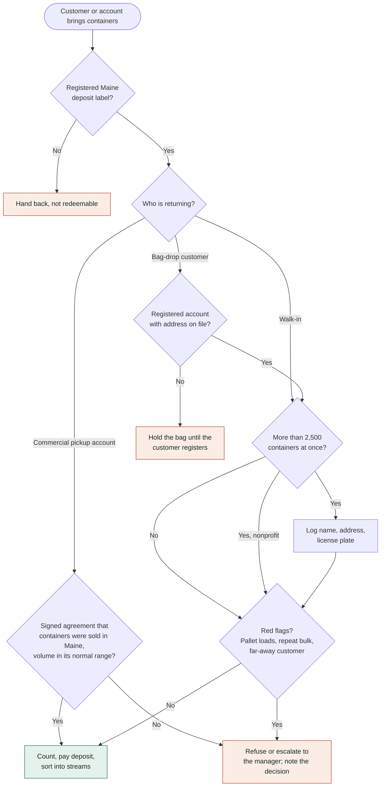

## 2. The business

Maine has run redemption centers since 1978 and had about 320 licensed centers before more than 50 closed after 2020 on thin fees. The 2023 modernization raised the fee to 6¢, indexed it to inflation, and forced distributors into a single commingling cooperative so operators sort by material, deposit, and size instead of by brand. That is a better business than the one that was closing, and the closures left gaps in coverage.

### How the cash moves

1. A customer brings containers. You pay the deposit out of your own float, 5¢ or 15¢ each.
2. Staff sort into cooperative-approved streams: aluminum, PET, glass, by deposit tier and size.
3. The cooperative's contracted agent picks up on a schedule and counts or weighs.
4. The cooperative reimburses the deposit plus the handling fee. Your gross margin is the handling fee, nothing else.

_You need working capital to fund the float between paying customers and being reimbursed. Plan on two to four weeks of deposits outstanding._

#### How the money moves

The deposit passes through. The handling fee is the only thing the center keeps.

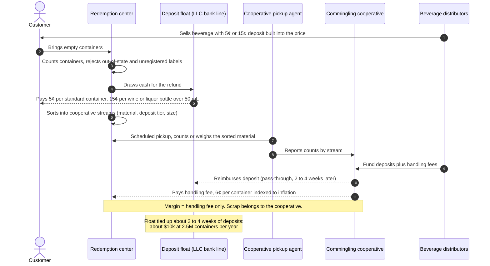

#### What happens to a container inside the center

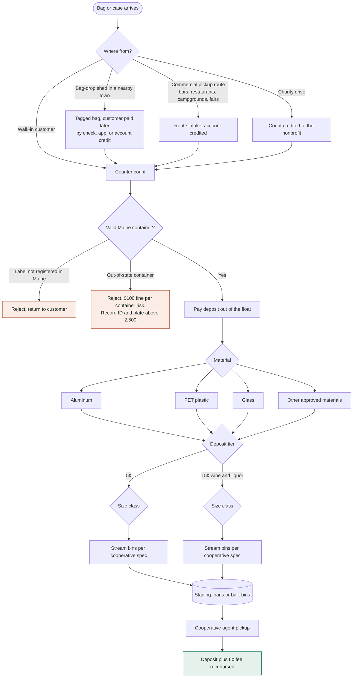

### Unit economics at three volumes

These are planning assumptions, not quotes. Labor is the whole game: a hand-sort line runs roughly 1,500 to 2,500 containers per person-hour depending on mix and whether you use a counting machine.

| Line item | 2M containers/yr | 4M/yr | 8M/yr |
| --- | --- | --- | --- |
| Handling fee revenue at 6¢ | $120,000 | $240,000 | $480,000 |
| Sorting labor at $17/hr loaded, ~2,000 per hr | −$17,000 | −$34,000 | −$68,000 |
| Counter and management labor | −$45,000 | −$70,000 | −$120,000 |
| Rent, 3,000 to 6,000 sq ft light industrial | −$30,000 | −$42,000 | −$60,000 |
| Insurance, utilities, bags, license, bank fees | −$18,000 | −$26,000 | −$40,000 |
| Deposit float tied up (capital, not an expense) | ~$8,000 | ~$16,000 | ~$32,000 |
| **Operating profit before owner pay and tax** | **≈ $10,000** | **≈ $68,000** | **≈ $192,000** |

The lesson in the table: a 2-million-container center is a job, not a business. Four million is the floor for a real return. Volume comes from household density, charity drives, and commercial accounts such as bars and restaurants that need pickup.

#### Profit by site and volume

Operating profit before owner pay and tax, from the two tables in the plan. A farm site with a usable building beats a rented town site because there is no rent.

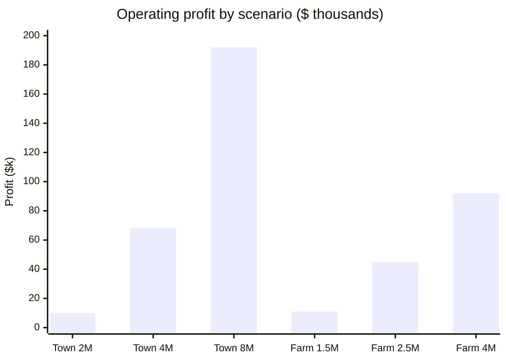

### Revenue levers beyond the fee

- **Commercial pickup routes.** Bars, restaurants, campgrounds, and event venues will hand over containers for a share of the deposit or for nothing. Each account is guaranteed volume.
- **Charity drive hosting.** Maine centers move over $2M a year to nonprofits. Hosting drives brings volume you did not have to market for.
- **Two storefronts, one back room.** The license is per site. A second drop-off feeding one sorting floor spreads the fixed cost.
- **Scrap value is not yours.** The cooperative owns the material once picked up. Do not plan on selling aluminum.

### Working with partners already in Maine

Having people on the ground is the biggest advantage you can have here. Split the roles: the Maine partner is the LLC's on-site manager, signs the DEP application on its behalf, and runs the counter and commercial accounts. The out-of-state partner funds the float and buildout, and handles bookkeeping and cooperative reporting. Write the operating agreement so the license, lease, and bank line sit with the LLC, not with any one person. The LLC is the applicant on the DEP form, so the license belongs to the company.

#### Who holds what

The license, lease, and bank line sit with the LLC, not with either person.

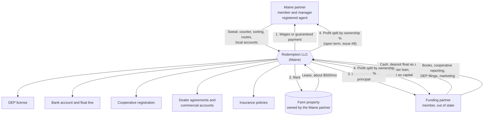

## 3. Where to put it

In Maine, a state-line site is the wrong instinct. New Hampshire has no deposit, so a center in Kittery, Berwick, or Fryeburg spends its life proving to DEP that its volume is not coming across the border. Go where Maine households are dense and the nearest center closed.

| Area | Why | Watch out |
| --- | --- | --- |
| Lewiston–Auburn | Second-largest metro, working-class density, fewer bag-drop kiosks than Portland | Two or three incumbents; find the neighborhood they don't cover |
| Bangor and Brewer | Regional hub for the whole north; commercial accounts from bars and UMaine events | Winter access and parking matter more than rent |
| Augusta–Waterville corridor | State workforce, colleges, closures since 2020 left towns without a center | Check DEP's current license list for gaps town by town |
| Midcoast: Rockland, Belfast, Damariscotta | Summer volume spikes, campgrounds and restaurants, few competitors | Off-season volume drops by half; staff seasonally |
| Greater Portland | Most containers in the state | CLYNK bag-drop at every Hannaford already owns the convenience customer; avoid unless you buy an existing center |

The concrete step: request the current licensed-center list from Maine DEP, plot it against town population, and rank towns by residents per center. Anything above about 8,000 residents per center within a 10-minute drive is a candidate. Buying a tired existing center with a customer base is usually cheaper than building from zero.

#### Site ranking at a glance

A qualitative read of section 3 of the plan, not measured data.

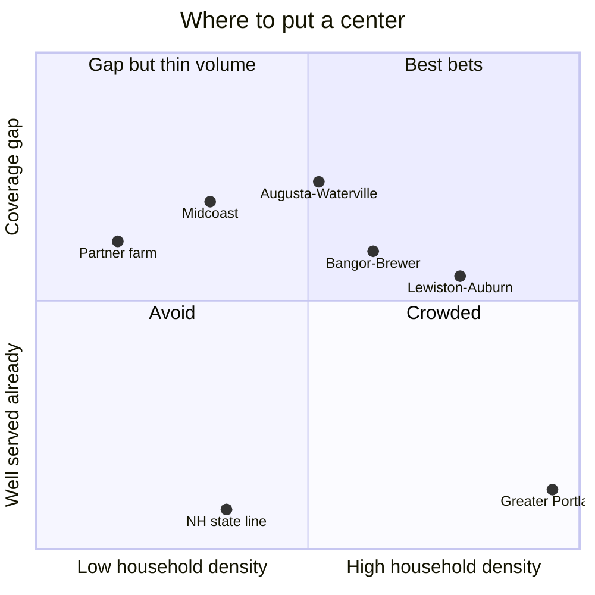

### Candidate site: a partner's farm

Our Maine partner has a small farm with goats and chickens, about an hour and a half south of Orono, and wants to diversify. That puts the site in the Augusta–Waterville corridor or the inland Midcoast, both on the list above. A farm site fixes the biggest line item after labor, rent. It also works against the main point of this plan, density. Three questions decide whether it works.

**1. Is there a license available in the farm's town?** The cap goes by the town the building sits in. Most towns in that band have under 5,000 people, so the rule is one center per town. If the town already has a center, the farm is out unless we can prove compelling need. If it has none, the one slot is open. The partner's county doesn't change any of this. What matters is the town and street address.

**2. Can it get enough containers?** Maine redeems roughly 850 million containers a year across about 1.4 million people, or about 600 per resident. One million containers a year is all the returns from about 1,700 people. A rural center that catches a third of the returns in its area needs about 10,000 people within reach to get to 2 million. One small town can't supply that, so the farm has to bring containers in:

- **Bag-drop points in nearby towns.** The DEP application asks for the address of each drop-off location where customers leave bags and get paid later. A locked shed at a store in the next town feeds the farm's sorting floor without a second license.
- **Commercial pickup.** Bars, restaurants, campgrounds and fairs. A farm truck and trailer are already paid for.
- **Member dealer agreements.** A store with 5,000 sq ft or more must offer redemption. A center can take on that duty for the store by agreement, which brings in all of its customers' returns.

**3. Is there a building, and can it be used in winter?** We don't yet know what buildings the farm has. Sorting is indoor, year-round work. The space needs heat, power, a restroom, a loading door, parking for about ten cars, and a plowed road. Most of the buildout money goes here.

| Farm site, line item | 1.5M/yr | 2.5M/yr | 4M/yr |
| --- | --- | --- | --- |
| Handling fee revenue at 6¢ | $90,000 | $150,000 | $240,000 |
| Sorting labor at $17/hr loaded, ~2,000 per hr | −$12,750 | −$21,250 | −$34,000 |
| Counter, route and management labor | −$40,000 | −$50,000 | −$70,000 |
| Lease of space to the LLC, $500/mo (paid to the farm) | −$6,000 | −$6,000 | −$6,000 |
| Insurance, heat, bags, license, bank fees | −$15,000 | −$20,000 | −$26,000 |
| Route fuel and vehicle wear | −$5,000 | −$8,000 | −$12,000 |
| Deposit float tied up (capital) | ~$6,000 | ~$10,000 | ~$16,000 |
| **Operating profit before owner pay and tax** | **≈ $11,000** | **≈ $45,000** | **≈ $92,000** |

_Planning assumptions. Buildout of an existing outbuilding (insulation, heat, restroom, bins, scale, signage) is estimated at $15,000 to $40,000 before quotes. If nothing on the farm will work, a new 30×40 ft post-frame building with a slab is likely $60,000 to $100,000, which changes the math. Get a contractor quote before committing. The farm earns the lease and any wages on top of its share of profit._

The verdict so far: with a usable building, a farm site beats a rented storefront at every volume. At 2.5 million containers it earns about what a rented town site earns at 3 to 3.5 million. It only works if the town has an open license and the partner commits to the bag-drop and pickup routes. Without those, it is a 1.5-million-container hobby. If a building has to be put up first, compare that cost against renting a storefront in the nearest town, with a bag-drop at the farm.

#### Can the farm be licensed? (issue #1)

Licenses are capped by the town the building sits in (38 M.R.S. §3113(3); 06-096 CMR ch. 426). The partner's county of domicile does not decide this.

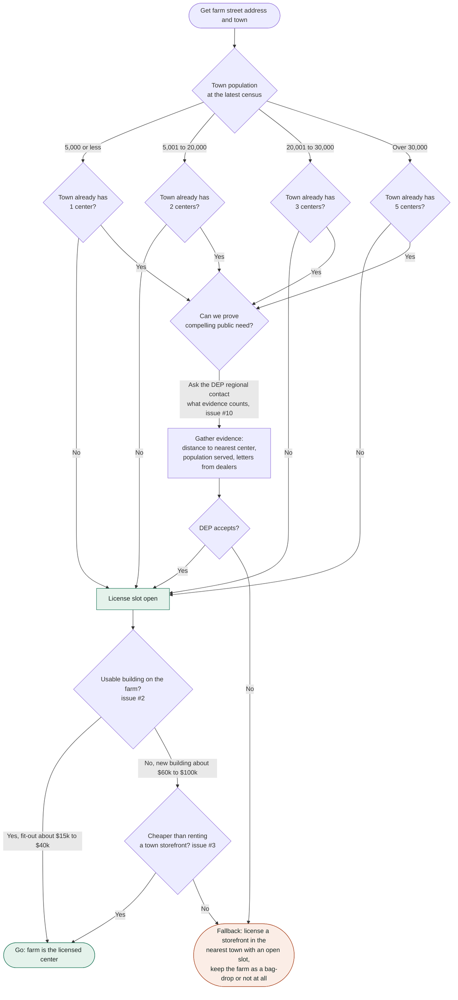

#### How a rural site reaches enough volume

Maine redeems about 850 million containers a year across about 1.4 million people, roughly 600 per resident. Catching a third of local returns, 2 million containers a year needs about 10,000 people within reach. One small town is not enough, so volume has to be brought in (issue #6).

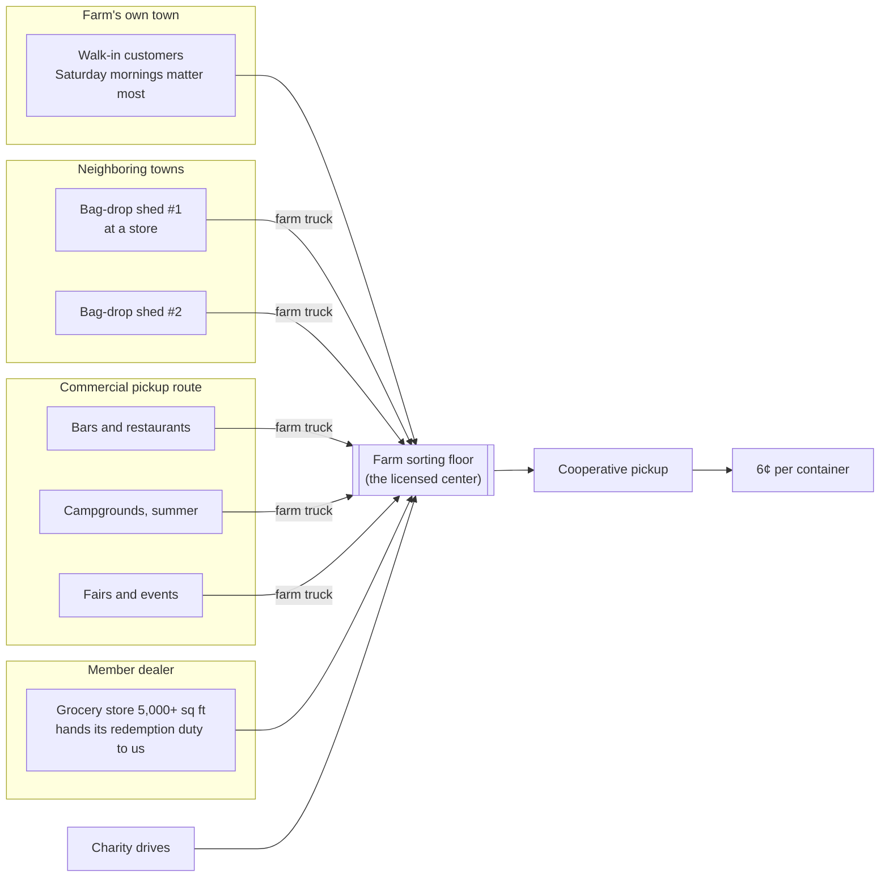

#### Where the money goes at a farm site, 2.5 million containers a year

$150,000 in handling fees at 6¢.

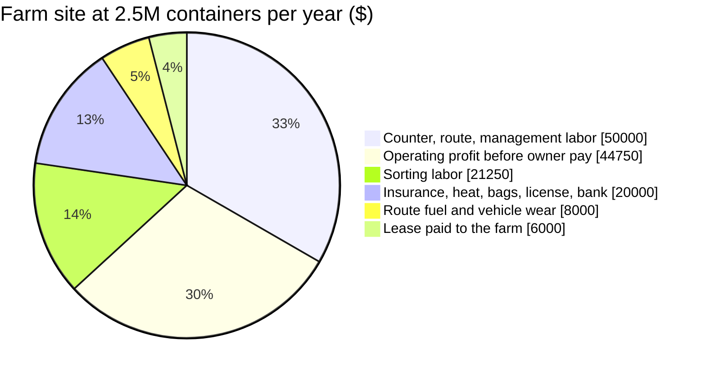

## 4. First 90 days

1. Email [bottlebill.dep@maine.gov](mailto:bottlebill.dep@maine.gov) for the current licensed-center list, the 2026 handling-fee figure after indexing, and the commingling cooperative's sorting spec. Then call the DEP regional contact for the site's county (listed on page 4 of the application) and ask whether the town has an open license.
2. Pick two candidate towns from the ranking above and have your Maine partner visit the incumbents on a Saturday morning. Count cars for an hour. That is your volume estimate.
3. Line up 3,000 to 6,000 square feet with a loading door, on a main road, with parking for ten cars.
4. Form the LLC, get general liability and workers' comp quotes, and open a bank line for the deposit float.
5. Within 30 days before filing, publish the Notice of Intent to File in the local paper and mail it to every landowner within 1,000 feet and to the town. Get at least one dealer agreement signed.
6. File the Redemption Center License Initial Application with DEP and the $100 fee, with the LLC's good-standing certificate and the lease. Register with the commingling cooperative for pickup.
7. Sign five commercial accounts before opening day. Restaurants and a campground are enough to cover the first month's payroll.
8. Open with three staff, a bag-count system, and clear signage on out-of-state limits so DEP has nothing to question.

#### From idea to license: the DEP path

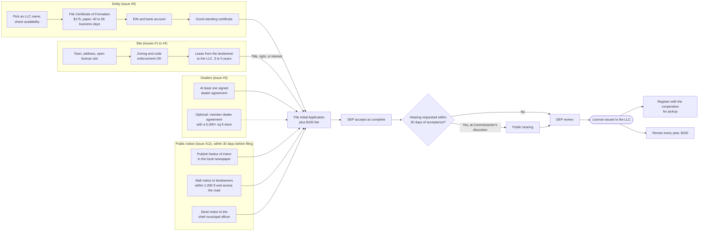

#### License lifecycle

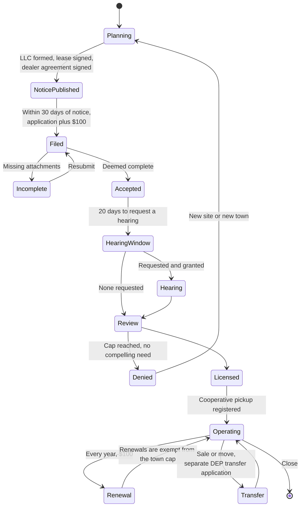

#### Timeline to opening

A target schedule starting October 2026. Dates move once issue #1 is answered.

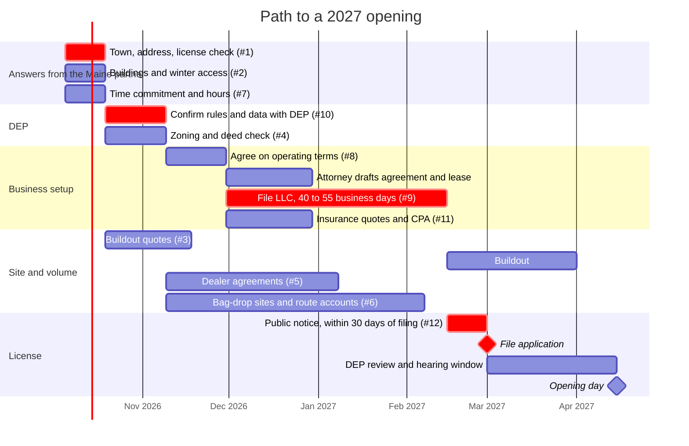

#### How the open questions depend on each other

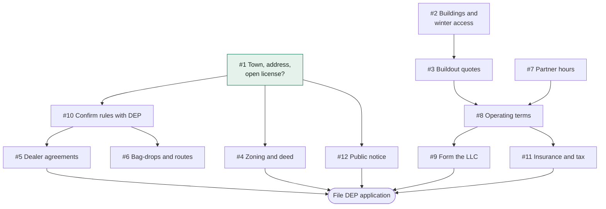

## 5. Side businesses for the farm

The partner wants to diversify the farm's income, and the redemption center needs only a building and a truck. These ideas use the land, run in other seasons, and, like the center, cost little to start. Details, licensing, and sources are in the repo's [ideas folder](https://github.com/wbp318/maine-business-2027/tree/main/ideas).

| Idea | Startup (est.) | Why it fits | State license |
| --- | --- | --- | --- |
| Winter boat and RV storage | $5k–25k | Idle land earns in winter; customers sign contracts and pay up front | None found; town zoning |
| Campsites, 4 or fewer | $2k–10k | Same land and gate earn in summer; campers bring containers | None under 5 sites; 9% lodging tax applies |
| Shoreland septic inspections | $3k–10k | Required by law at every shoreland sale, the same kind of demand as the handling fee | DHHS certification and exam |
| Firewood | $5k–25k | Maine bans most out-of-state firewood, which favors local wood; bundles sell to campers | Sold by the cord; Forest Service reporting |
| Snow plowing contracts | $8k–20k | Winter income from the farm truck; multi-year town bids | None; contract insurance |

> **Check before using any land.** If the farm is enrolled in Maine's Farmland current-use tax program, converting enrolled acres to commercial use can trigger a penalty of about five years of tax savings. Ask whether sewage sludge was ever spread on the land, since Maine banned it in 2022 over PFAS.

## 6. Grants and financing

We checked about 90 programs. True grants for a for-profit startup are rare: most grant money goes to towns and nonprofits. What the LLC can actually get is mostly loans, loan insurance, rebates, and tax write-offs, plus one grant written for this business. Full research, calendar, and sources are in the repo's [grants folder](https://github.com/wbp318/maine-business-2027/tree/main/grants).

| Program | For | Type | What it's worth |
| --- | --- | --- | --- |
| CCET Fund, Maine DEP | LLC | Grant | At least 25% of reverse vending machines and automated counting equipment. Pool cut to $500k a year in 2025; ask DEP when the next round opens. |
| Maine SBDC | LLC | Free advising | Business plan, projections, and loan package |
| Bank loan with FAME loan insurance, or SBA 7(a)/504 | LLC | Loan | FAME insures up to 90%; SBA now requires every owner to be a U.S. citizen |
| CEI, KVCOG, or MCOG loan funds | LLC | Loan | Gap and micro loans; KVCOG and MCOG up to $200k, depending on county |
| Efficiency Maine | LLC | Rebate | $750 per heat pump in a converted building; 65% of LED cost. Needs the LLC's own commercial meter |
| Section 179 and bonus depreciation | Both | Tax | 100% first-year federal write-off of equipment and fit-out; Maine does not follow bonus depreciation |
| NRCS EQIP, WoodsWISE | Farm | Cost-share | Fencing, livestock water, woodlot work; needs an FSA farm number |
| Farms for the Future, SARE, Northeast Farmers Fund | Farm | Grant | $6k business plan then a $25k grant; up to $30k for on-farm trials; Northeast Farmers Fund open now |

> **Keep the redemption center in its own LLC.** Farm programs won't fund the center, storage, or campsites, and mixing them puts the farm's eligibility at risk.

## 7. Students and universities

Maine's public universities can supply help we'd otherwise pay consultants for. The repo's [internships folder](https://github.com/wbp318/maine-business-2027/tree/main/internships) has eleven ready-to-send project pitches, the programs that fit each, and the hiring rules.

- **Free:** UMaine's Black Bear Consulting Corps (a five-week student team, free under 50 employees) for the market study; computer science capstones for the count dashboard and route optimizer; graduate research on the farm funded by SARE.
- **Paid, close by:** UMA in Augusta requires a CIS internship for its bachelor's degree, and its online-first program suits a remote supervisor.
- **Paid by others:** Maine Geospatial Institute interns ($19/hr, state-funded) for GIS site selection; Innovate for Maine fellows.
- **Now:** UMaine forestry interviews for summer 2027 close in mid-November 2026. A woodlot plan from a forestry intern also qualifies the farm for WoodsWISE and NRCS cost-share.

_Anything that is real work (counting, firewood, storage, production code) must be paid at least Maine's $15.10/hr minimum wage. Unpaid fits only credit-bearing projects directed by faculty._

> **What made this look better than it is.** The Parish Brewing label that started this reads "OK+ 10¢ MI" because its deposit line was typed before 2011 and never fixed. It still lists Delaware, which repealed its deposit that year, and Oregon at 5¢, which changed in 2017. Oklahoma has never had a deposit law. The number on a label is not the law; the statutes above are.

## Sources

- [Maine DEP, Beverage Container Redemption Program (license application, cooperative plan)](https://www.maine.gov/dep/sustainability/bottlebill/index.html)
- [Maine DEP, Initial Application for a Redemption Center License (04/2026)](https://www.maine.gov/dep/sustainability/bottlebill/documents/Fillable%20Initial%20RC%20application%202026.pdf)
- [38 M.R.S. §3113, licensing requirements and per-town caps](https://legislature.maine.gov/statutes/38/title38sec3113.html)
- [06-096 CMR ch. 426, one center in towns of 5,000 or less](https://www.law.cornell.edu/regulations/maine/department-06/division-096/chapter-426)
- [Kennebec Journal, unclaimed deposits debate and license-cap enforcement (April 2026)](https://www.centralmaine.com/2026/04/13/maine-lawmakers-debating-use-of-unclaimed-bottle-bill-deposits/)
- [22 M.R.S. §2492, campground licensing threshold](https://legislature.maine.gov/statutes/22/title22sec2492.html)
- [PL 2019 c.43, shoreland septic inspection at sale](https://www.mainelegislature.org/legis/bills/bills_129th/chapters/PUBLIC43.asp)
- [36 M.R.S. §1112-C, farmland current-use withdrawal penalty](https://legislature.maine.gov/statutes/36/title36sec1112-C.pdf)
- [38 M.R.S. §3114-A, CCET Fund for redemption technology](https://legislature.maine.gov/statutes/38/title38sec3114-A.html)
- [Bottle Bill Resource Guide, Maine (fee, deposits, redemption rates, out-of-state penalties)](https://www.bottlebill.org/maine/)
- [Waste Dive, Maine raises handling fee to 6¢ (2023)](https://www.wastedive.com/news/maine-governor-bottle-bill-handling-fee-poland-spring/649775/)
- [Maine Public, redemption center closures and modernization](https://www.mainepublic.org/business-and-economy/2023-03-29/as-redemption-centers-close-maine-seeks-to-modernize-its-bottle-deposit-law)
- [NRCM, how Maine modernized the bottle bill (commingling cooperative)](https://www.nrcm.org/blog/how-maine-modernized-bottle-bill/)
- [NCSL, state beverage container deposit laws](https://www.ncsl.org/environment-and-natural-resources/state-beverage-container-deposit-laws)
- [Bottle Bill Resource Guide, Oklahoma past campaigns (no law enacted)](https://www.bottlebill.org/index.php/past-campaigns/oklahoma-past-campaigns)

_Labor, rent, throughput, and buildout figures in sections 2 and 3 are planning assumptions, not verified operator data; replace them with numbers from the two centers you visit._
