# bottle_recycling_2027

<!-- BEGIN BADGES (generated by scripts/build_docs.py) -->
     

          
<!-- END BADGES -->

Planning repo for a licensed beverage container redemption center in Maine, targeting a 2027 opening.

## What this is

Maine pays licensed redemption centers a per-container handling fee, set in statute and indexed to inflation, on top of refunding the customer's deposit. That fee is the entire margin of the business. This repo holds the plan, the numbers behind it, and the working documents we use to get from idea to a DEP license.

## The plan

Read [PLAN.md](https://github.com/wbp318/bottle_recycling_2027/blob/main/PLAN.md) right here on GitHub, with every chart in place. Or open [maine-redemption-plan.html](https://github.com/wbp318/bottle_recycling_2027/blob/main/maine-redemption-plan.html) in a browser, or read the published version:

https://claude.ai/code/artifact/4e2bd70e-2a05-4e02-8523-a8b3e40098a2

It covers:

- **The rules.** Deposit tiers, who may take returns, the handling fee, licensing, unclaimed deposits, and out-of-state container penalties.
- **How the cash moves.** Customer deposit out of our float, sort into cooperative streams, agent pickup, reimbursement of deposit plus fee.
- **Unit economics** at 2, 4, and 8 million containers a year, with labor, rent, overhead, and float. Planning assumptions are labeled as such.
- **Site ranking.** Lewiston-Auburn, Bangor, the Augusta-Waterville corridor, and the Midcoast, and why the New Hampshire line and Portland are the wrong places.
- **A farm candidate site.** A Maine partner's farm south of Orono: per-town license caps, bag-drop and pickup routes to make up for low density, and economics with no rent.
- **Diagrams** of the money flow, sorting, licensing decisions, partner structure, and timeline are [below](#diagrams).
- **Partner roles** for a Maine operator and an out-of-state funder.
- **Grants and financing**, summarized below and detailed in the [grants folder](https://github.com/wbp318/bottle_recycling_2027/tree/main/grants).
- **Internships and university projects**, summarized below and detailed in the [internships folder](https://github.com/wbp318/bottle_recycling_2027/tree/main/internships).
- **Side businesses** for the farm, summarized below and detailed in [ideas/](https://github.com/wbp318/bottle_recycling_2027/tree/main/ideas).
- **A 90-day launch checklist**, starting with the DEP information request.

## Key facts

| Item | Maine |
| --- | --- |
| Deposit | 5¢ standard, 15¢ wine and liquor over 50 mL |
| Handling fee to operator | 6¢ per container as of Sept 2023, indexed from Jan 2025 |
| License | $100 per year, Maine DEP |
| License cap | 1 center in towns of 5,000 or less; 2, 3, or 5 in larger towns |
| To be licensed | LLC in good standing, deed or lease, one dealer agreement, public notice |
| 2025 redemption rate | 69% |
| Out-of-state containers | $100 fine each; ID and plate recorded above 2,500 |

## Diagrams

GitHub renders these. Dollar figures are the plan's planning assumptions, not quotes. Issue numbers refer to this repo's open questions. Each chart lives in the [diagrams folder](https://github.com/wbp318/bottle_recycling_2027/tree/main/diagrams) and is copied here and into [PLAN.md](https://github.com/wbp318/bottle_recycling_2027/blob/main/PLAN.md) by the build script.

<!-- BEGIN DIAGRAMS (generated by scripts/build_docs.py) -->

### 1. How the money moves

The deposit passes through. The handling fee is the only thing the center keeps.

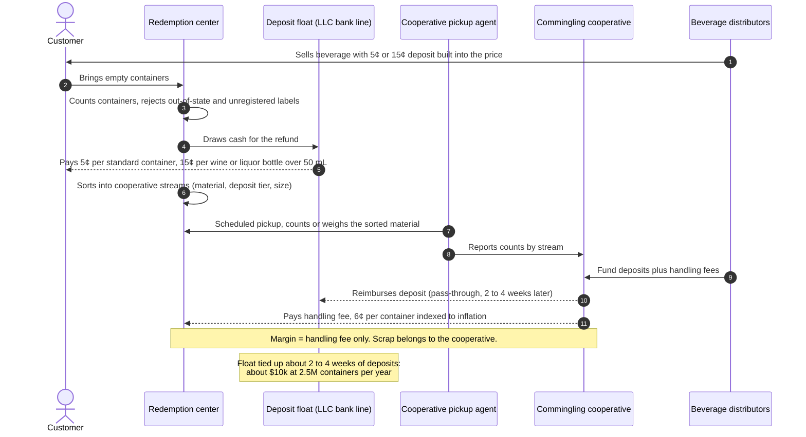

### 2. What happens to a container inside the center

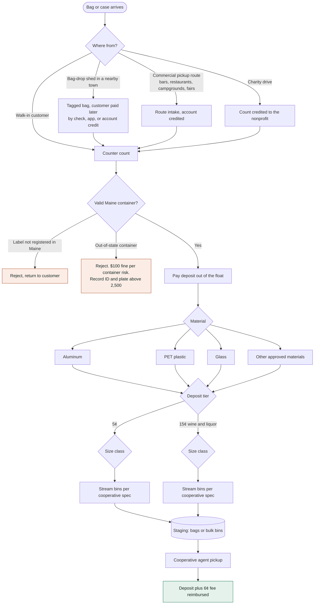

### 3. Can the farm be licensed? (issue #1)

Licenses are capped by the town the building sits in (38 M.R.S. §3113(3); 06-096 CMR ch. 426). The partner's county of domicile does not decide this.

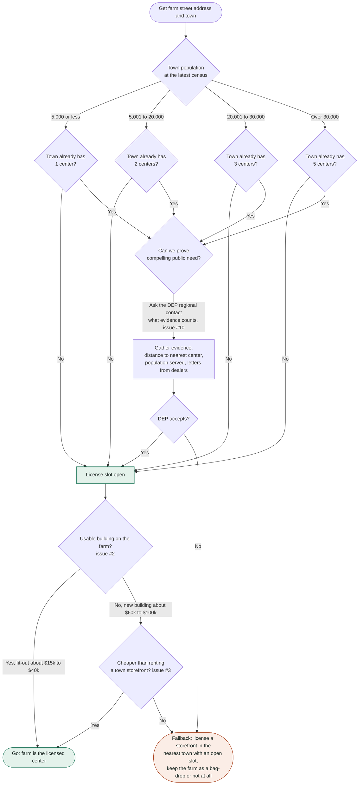

### 4. From idea to license: the DEP path

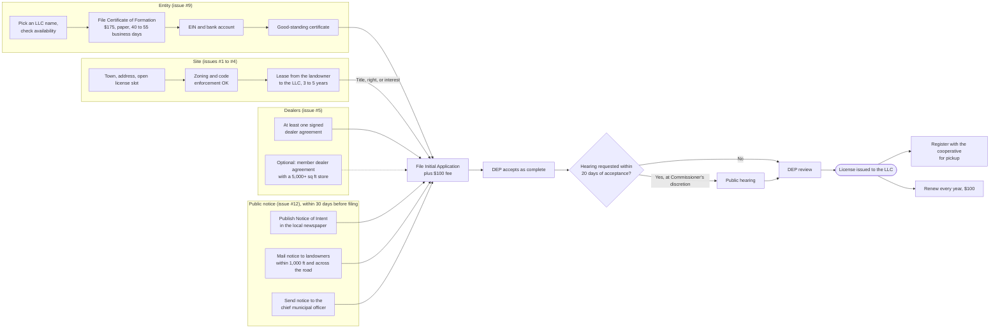

### 5. Who holds what

The license, lease, and bank line sit with the LLC, not with either person.

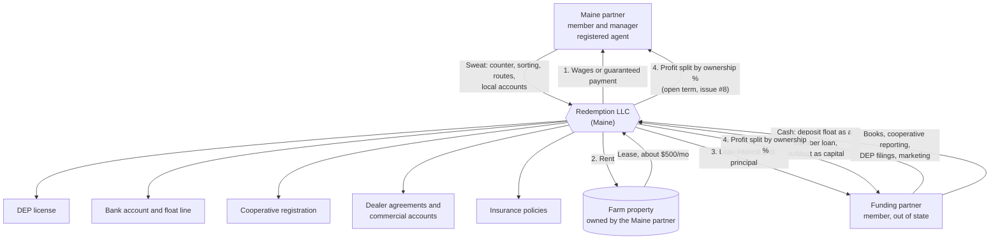

### 6. How a rural site reaches enough volume

Maine redeems about 850 million containers a year across about 1.4 million people, roughly 600 per resident. Catching a third of local returns, 2 million containers a year needs about 10,000 people within reach. One small town is not enough, so volume has to be brought in (issue #6).

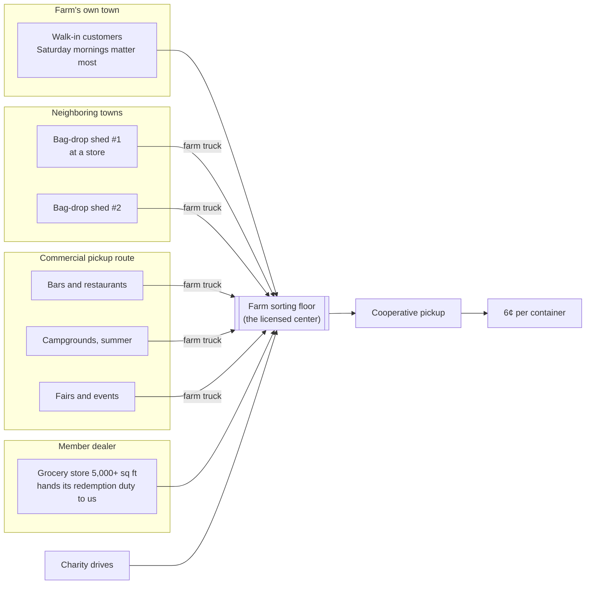

### 7. Where the money goes at a farm site, 2.5 million containers a year

$150,000 in handling fees at 6¢.

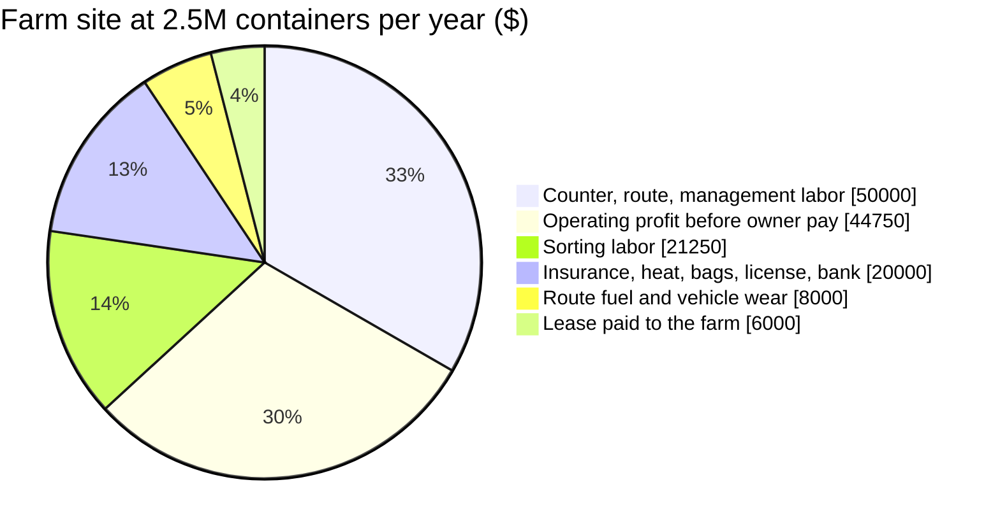

### 8. Profit by site and volume

Operating profit before owner pay and tax, from the two tables in the plan. A farm site with a usable building beats a rented town site because there is no rent.

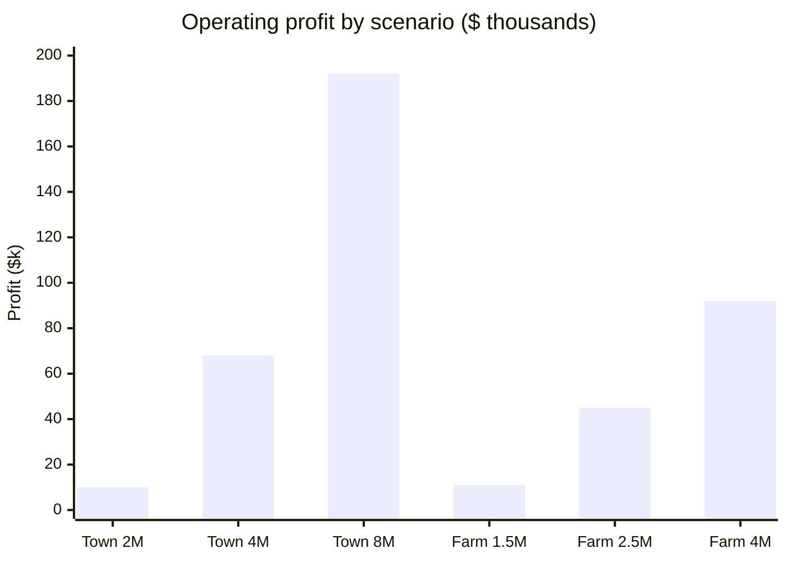

### 9. Site ranking at a glance

A qualitative read of section 3 of the plan, not measured data.

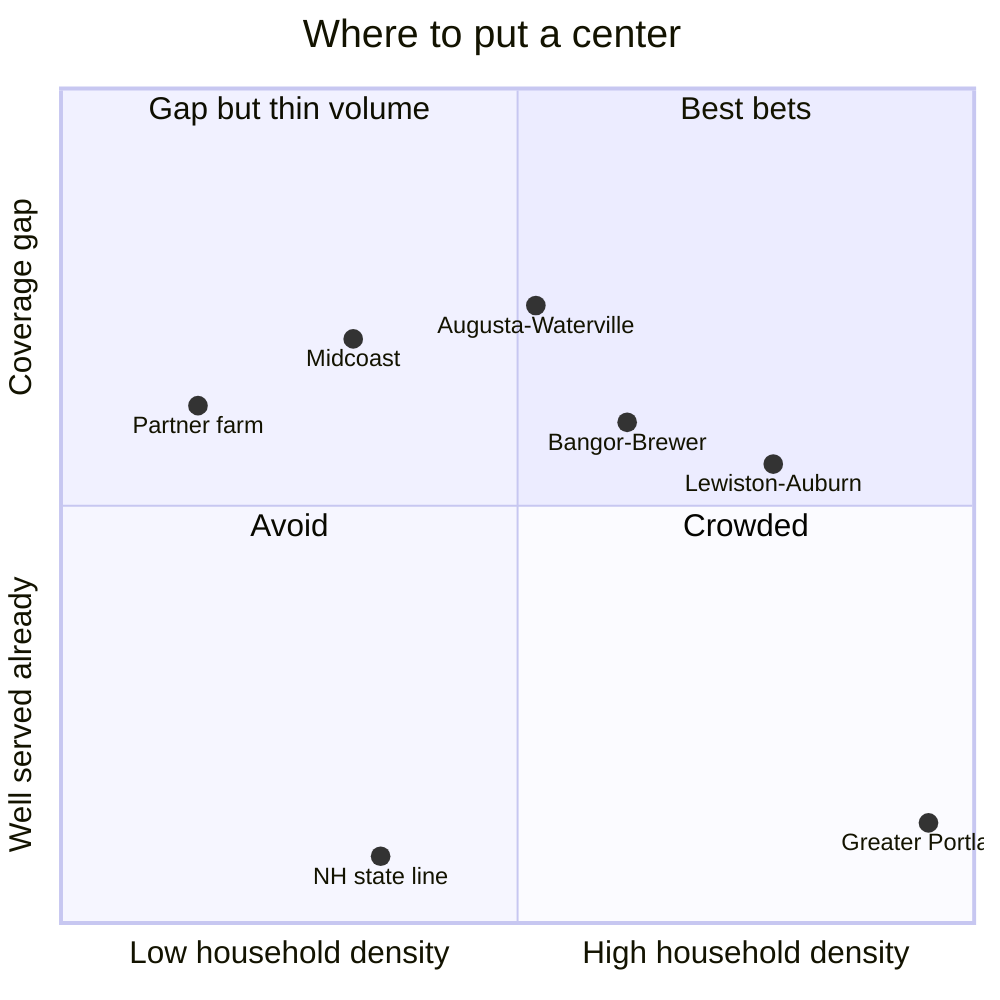

### 10. License lifecycle

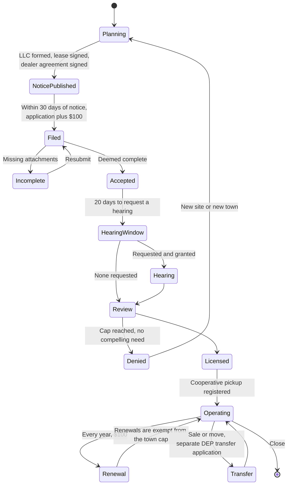

### 11. Timeline to opening

A target schedule starting October 2026. Dates move once issue #1 is answered.

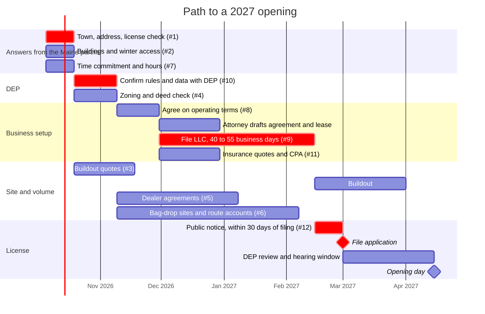

### 12. How the open questions depend on each other

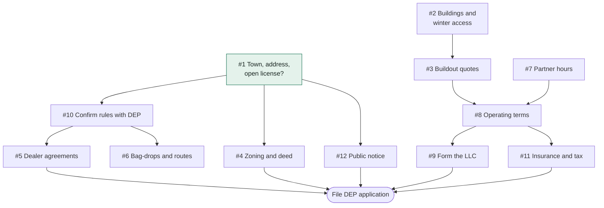

<!-- END DIAGRAMS -->

## Other low-cost ideas

The redemption center works because state law sets the fee and guarantees the demand, while the capital needed is small. [ideas/](https://github.com/wbp318/bottle_recycling_2027/tree/main/ideas) looks for other businesses like that which could run on the Maine partner's farm, with a page per idea covering revenue, startup cost, Maine licensing, risks, and who does what.

| Rank | Idea | Startup (est.) | Where demand comes from | State license |
| --- | --- | --- | --- | --- |
| 1 | [Winter boat and RV storage](https://github.com/wbp318/bottle_recycling_2027/blob/main/ideas/boat-rv-storage.md) | $5k–25k | Short boating season; RVs idle all winter | None found; town zoning only |
| 2 | [Campsites, 4 or fewer to start](https://github.com/wbp318/bottle_recycling_2027/blob/main/ideas/campground.md) | $2k–10k | Summer tourism | None at 4 or fewer; ME CDC at 5+ ($205/yr) |
| 3 | [Shoreland septic inspections](https://github.com/wbp318/bottle_recycling_2027/blob/main/ideas/septic-inspections.md) | $3k–10k | Required by law at every shoreland sale | DHHS certification |
| 4 | [Firewood](https://github.com/wbp318/bottle_recycling_2027/blob/main/ideas/firewood.md) | $5k–25k | Heating; the out-of-state firewood ban favors local wood | Sold by the cord; MFS reporting |
| 5 | [Snow plowing contracts](https://github.com/wbp318/bottle_recycling_2027/blob/main/ideas/snow-plowing.md) | $8k–20k | Town and school bids | None; contract insurance |
| 6–9 | [Kennel, horse boarding, agritourism, sawmill](https://github.com/wbp318/bottle_recycling_2027/blob/main/ideas/other-farm-ideas.md) | $5k–50k+ | Varies | Varies |
| — | [Grants](https://github.com/wbp318/bottle_recycling_2027/tree/main/grants) | about $0 | About 90 programs; see below | n/a |

Set aside after checking: solar leases, septage, e-waste, packaging EPR, mattresses, tires, composting ([why](https://github.com/wbp318/bottle_recycling_2027/blob/main/ideas/not-recommended.md)).

**Suggested order:** storage plus up to four campsites first, since they share the land and gate, need no state license at that size, and cover both seasons. Add plowing and firewood next. Before any of it, check the farm's current-use tax enrollment and whether sludge was ever spread on the land.

## Grants and financing

The [grants folder](https://github.com/wbp318/bottle_recycling_2027/tree/main/grants) covers about 90 programs, with a calendar and charts in its [README](https://github.com/wbp318/bottle_recycling_2027/blob/main/grants/README.md):

- [Redemption center](https://github.com/wbp318/bottle_recycling_2027/blob/main/grants/redemption-center.md)
- [Farm and agriculture](https://github.com/wbp318/bottle_recycling_2027/blob/main/grants/farm-and-agriculture.md)
- [Small business and rural](https://github.com/wbp318/bottle_recycling_2027/blob/main/grants/small-business-and-rural.md)
- [Energy and buildings](https://github.com/wbp318/bottle_recycling_2027/blob/main/grants/energy-and-buildings.md)

What we found:

- **One grant fits the center itself.** Maine DEP's [CCET Fund](https://legislature.maine.gov/statutes/38/title38sec3114-A.html) pays at least 25% of reverse vending machines and automated counting equipment.
- **Most other money for the LLC is loans, loan insurance, rebates, and tax write-offs.** That means FAME, SBA, CEI, regional loan funds, Efficiency Maine, and Section 179.
- **The farm has more true grants:** NRCS EQIP, WoodsWISE, Farms for the Future, SARE, and the Northeast Farmers Fund (open now). All of them need an FSA farm number first.
- **Federal rules changed in 2025–26:** REAP grants were frozen and rewritten, SBA requires all-citizen ownership, and bonus depreciation is now permanent federally (Maine doesn't follow it).

## Internships and university projects

The [internships folder](https://github.com/wbp318/bottle_recycling_2027/tree/main/internships) maps how to work with students and faculty at UMaine, UMA, USM, the other UMS campuses, and the community colleges:

- [Forestry, agriculture, and environment](https://github.com/wbp318/bottle_recycling_2027/blob/main/internships/forestry-ag-environment.md)
- [Tech and business](https://github.com/wbp318/bottle_recycling_2027/blob/main/internships/tech-and-business.md)
- [Eleven project pitches](https://github.com/wbp318/bottle_recycling_2027/blob/main/internships/project-briefs.md), such as a count dashboard, a computer-vision classifier, a route optimizer, GIS site selection, and a woodlot plan
- [Hiring rules](https://github.com/wbp318/bottle_recycling_2027/blob/main/internships/hiring-rules.md)

What we found:

- **Free options:** UMaine's Black Bear Consulting Corps (free under 50 employees), computer science capstones, class projects, and hosting SARE-funded graduate research.
- **Closest campus:** UMA in Augusta, whose CIS degree requires an internship.
- **Most urgent:** UMaine forestry interviews for summer 2027 close in mid-November 2026.

## Status

- [x] Confirm the legal model and fee structure
- [x] Draft the plan and site ranking
- [x] Pull the 2026 DEP initial application and map its requirements
- [ ] Get the Maine partner's town and site address; check for an open license there
- [ ] Request current license list and 2026 fee figure from Maine DEP
- [ ] Visit two incumbent centers and count volume
- [ ] Form the LLC and line up the deposit float
- [ ] Sign first commercial pickup accounts
- [ ] File the Redemption Center License Initial Application

## Repo layout

| Path | What it is |
| --- | --- |
| [maine-redemption-plan.html](https://github.com/wbp318/bottle_recycling_2027/blob/main/maine-redemption-plan.html) | The plan, self-contained, opens in any browser |
| [PLAN.md](https://github.com/wbp318/bottle_recycling_2027/blob/main/PLAN.md) | The plan as Markdown with every chart in place. Generated from the HTML; do not edit by hand |
| [README.md](https://github.com/wbp318/bottle_recycling_2027/blob/main/README.md) | This file |
| [diagrams/](https://github.com/wbp318/bottle_recycling_2027/tree/main/diagrams) | One Mermaid chart per file, shared by the README and PLAN.md |
| [scripts/build_docs.py](https://github.com/wbp318/bottle_recycling_2027/blob/main/scripts/build_docs.py) | Rebuilds PLAN.md and the README charts; CI runs it on every push |
| [ideas/](https://github.com/wbp318/bottle_recycling_2027/tree/main/ideas) | Other low-cost businesses for the farm, one page per idea |
| [grants/](https://github.com/wbp318/bottle_recycling_2027/tree/main/grants) | Grants, loans, and incentives: about 90 programs in four pages, with charts and a calendar |
| [internships/](https://github.com/wbp318/bottle_recycling_2027/tree/main/internships) | University internships, capstones, and research partnerships, with project pitches and hiring rules |
| [.github/workflows/ci.yml](https://github.com/wbp318/bottle_recycling_2027/blob/main/.github/workflows/ci.yml) | CI: keeps PLAN.md in sync, renders every Mermaid diagram, checks the plan HTML, blocks private files, reports dead links |
| [.github/scripts/](https://github.com/wbp318/bottle_recycling_2027/tree/main/.github/scripts) | Helper scripts the CI runs |
| [LICENSE](https://github.com/wbp318/bottle_recycling_2027/blob/main/LICENSE) | All rights reserved. Viewing only; no copying or commercial use without both partners' written permission |
| [.gitattributes](https://github.com/wbp318/bottle_recycling_2027/blob/main/.gitattributes) | Linguist overrides so every file type shows in the language bar |
| [.gitignore](https://github.com/wbp318/bottle_recycling_2027/blob/main/.gitignore) | Keeps correspondence drafts and partner documents (the private folder) out of the repo |

## Sources

- [Maine DEP, Beverage Container Redemption Program](https://www.maine.gov/dep/sustainability/bottlebill/index.html)
- [Bottle Bill Resource Guide, Maine](https://www.bottlebill.org/maine/)
- [Waste Dive, Maine raises handling fee to 6¢](https://www.wastedive.com/news/maine-governor-bottle-bill-handling-fee-poland-spring/649775/)
- [Maine Public, redemption center closures and modernization](https://www.mainepublic.org/business-and-economy/2023-03-29/as-redemption-centers-close-maine-seeks-to-modernize-its-bottle-deposit-law)
- [NRCM, how Maine modernized the bottle bill](https://www.nrcm.org/blog/how-maine-modernized-bottle-bill/)
- [NCSL, state beverage container deposit laws](https://www.ncsl.org/environment-and-natural-resources/state-beverage-container-deposit-laws)

## A note on how this started

A Parish Brewing label reads "OK+ 10¢ MI" on its deposit line. Oklahoma has never had a bottle deposit law. The label text was typed before 2011 and never fixed: it still lists Delaware, which repealed its deposit that year, and Oregon at 5¢, which moved to 10¢ in 2017. The label is not the law. The statutes above are.

## License

Copyright (c) 2026 William Brooks Parker and Brandon Cormier. All rights reserved. This repository is published for viewing only; see [LICENSE](https://github.com/wbp318/bottle_recycling_2027/blob/main/LICENSE).
