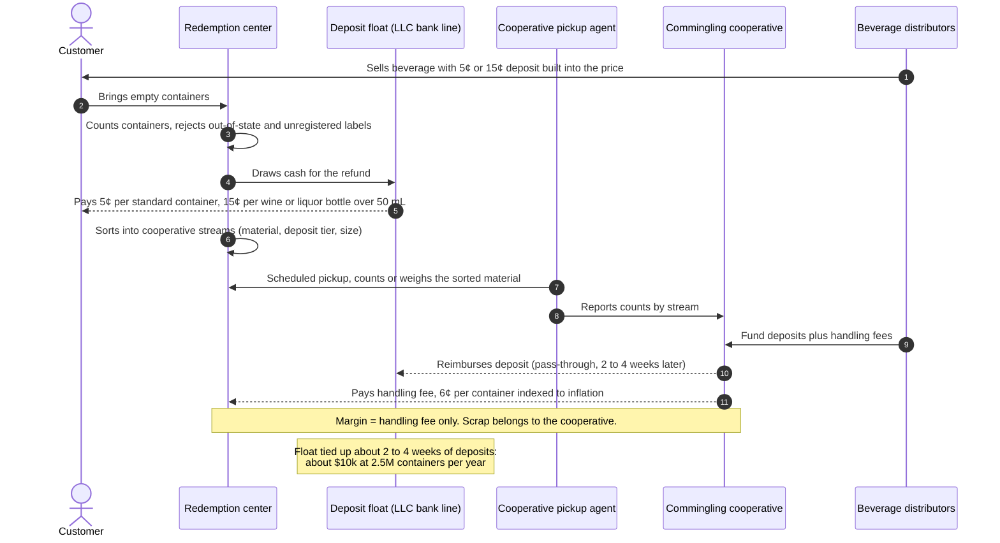

### How the money moves

The deposit passes through. The handling fee is the only thing the center keeps.

```mermaid
sequenceDiagram
    autonumber
    actor C as Customer
    participant RC as Redemption center
    participant F as Deposit float (LLC bank line)
    participant A as Cooperative pickup agent
    participant CO as Commingling cooperative
    participant D as Beverage distributors

    D->>C: Sells beverage with 5¢ or 15¢ deposit built into the price
    C->>RC: Brings empty containers
    RC->>RC: Counts containers, rejects out-of-state and unregistered labels
    RC->>F: Draws cash for the refund
    F-->>C: Pays 5¢ per standard container, 15¢ per wine or liquor bottle over 50 mL
    RC->>RC: Sorts into cooperative streams (material, deposit tier, size)
    A->>RC: Scheduled pickup, counts or weighs the sorted material
    A->>CO: Reports counts by stream
    D->>CO: Fund deposits plus handling fees
    CO-->>F: Reimburses deposit (pass-through, 2 to 4 weeks later)
    CO-->>RC: Pays handling fee, 6¢ per container indexed to inflation
    Note over RC,CO: Margin = handling fee only. Scrap belongs to the cooperative.
    Note over F: Float tied up about 2 to 4 weeks of deposits:<br/>about $10k at 2.5M containers per year
```
