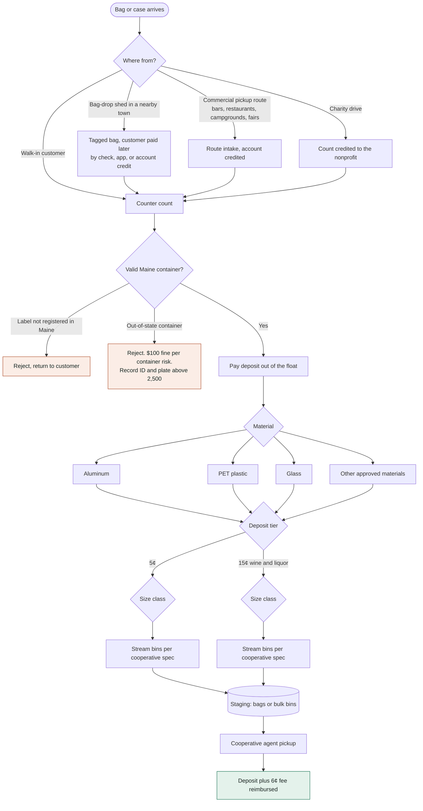

### What happens to a container inside the center

```mermaid
flowchart TD
    IN([Bag or case arrives]) --> SRC{Where from?}
    SRC -->|Walk-in customer| CTR[Counter count]
    SRC -->|Bag-drop shed in a nearby town| TAG[Tagged bag, customer paid later<br/>by check, app, or account credit]
    SRC -->|Commercial pickup route<br/>bars, restaurants, campgrounds, fairs| RTE[Route intake, account credited]
    SRC -->|Charity drive| CH[Count credited to the nonprofit]
    TAG --> CTR
    RTE --> CTR
    CH --> CTR

    CTR --> CHK{Valid Maine container?}
    CHK -->|Label not registered in Maine| REJ[Reject, return to customer]
    CHK -->|Out-of-state container| OOS[Reject. $100 fine per container risk.<br/>Record ID and plate above 2,500]
    CHK -->|Yes| PAY[Pay deposit out of the float]

    PAY --> MAT{Material}
    MAT --> AL[Aluminum]
    MAT --> PET[PET plastic]
    MAT --> GL[Glass]
    MAT --> OT[Other approved materials]

    AL --> TIER{Deposit tier}
    PET --> TIER
    GL --> TIER
    OT --> TIER
    TIER -->|5¢| SZ5{Size class}
    TIER -->|15¢ wine and liquor| SZ15{Size class}
    SZ5 --> BIN5[Stream bins per cooperative spec]
    SZ15 --> BIN15[Stream bins per cooperative spec]
    BIN5 --> STG[(Staging: bags or bulk bins)]
    BIN15 --> STG
    STG --> PICK[Cooperative agent pickup]
    PICK --> REIMB[Deposit plus 6¢ fee reimbursed]

    classDef bad fill:#FBEDE6,stroke:#A8401B,color:#1A2622
    classDef good fill:#E4F2EB,stroke:#0C6B4C,color:#1A2622
    class REJ,OOS bad
    class REIMB good
```
