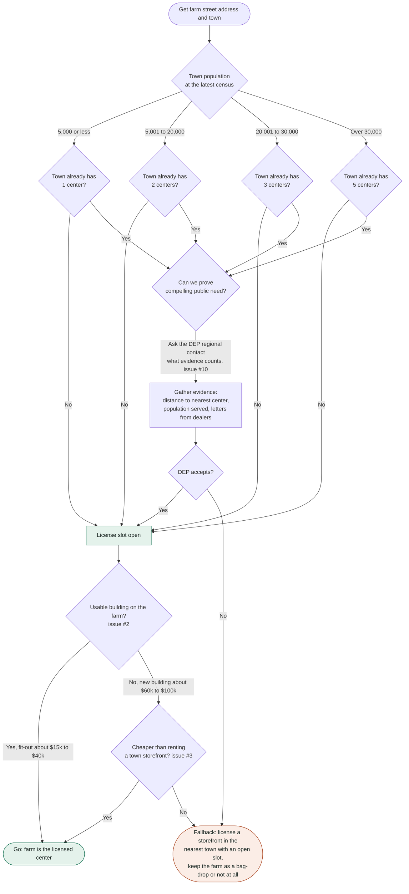

### Can the farm be licensed? (issue #1)

Licenses are capped by the town the building sits in (38 M.R.S. §3113(3); 06-096 CMR ch. 426). The partner's county of domicile does not decide this.

```mermaid
flowchart TD
    START([Get farm street address and town]) --> POP{Town population<br/>at the latest census}
    POP -->|5,000 or less| C1{Town already has<br/>1 center?}
    POP -->|5,001 to 20,000| C2{Town already has<br/>2 centers?}
    POP -->|20,001 to 30,000| C3{Town already has<br/>3 centers?}
    POP -->|Over 30,000| C5{Town already has<br/>5 centers?}

    C1 -->|No| OPEN[License slot open]
    C2 -->|No| OPEN
    C3 -->|No| OPEN
    C5 -->|No| OPEN
    C1 -->|Yes| CN{Can we prove<br/>compelling public need?}
    C2 -->|Yes| CN
    C3 -->|Yes| CN
    C5 -->|Yes| CN

    CN -->|Ask the DEP regional contact<br/>what evidence counts, issue #10| EV[Gather evidence:<br/>distance to nearest center,<br/>population served, letters from dealers]
    EV --> CNY{DEP accepts?}
    CNY -->|Yes| OPEN
    CNY -->|No| ALT

    OPEN --> BLD{Usable building on the farm?<br/>issue #2}
    BLD -->|Yes, fit-out about $15k to $40k| GO([Go: farm is the licensed center])
    BLD -->|No, new building about $60k to $100k| CMP{Cheaper than renting<br/>a town storefront? issue #3}
    CMP -->|Yes| GO
    CMP -->|No| ALT

    ALT([Fallback: license a storefront in the<br/>nearest town with an open slot,<br/>keep the farm as a bag-drop or not at all])

    classDef go fill:#E4F2EB,stroke:#0C6B4C,color:#1A2622
    classDef stop fill:#FBEDE6,stroke:#A8401B,color:#1A2622
    class GO,OPEN go
    class ALT stop
```
