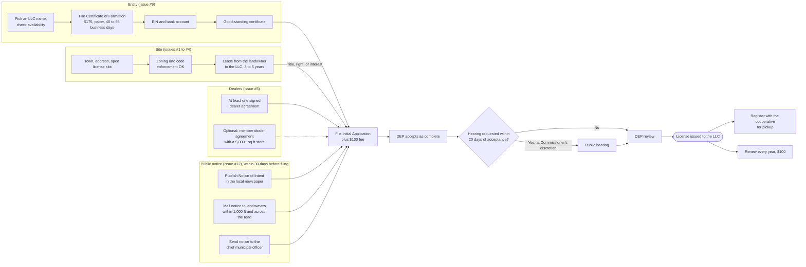

### From idea to license: the DEP path

```mermaid
flowchart LR
    subgraph ENT["Entity (issue #9)"]
        direction TB
        N1[Pick an LLC name,<br/>check availability] --> N2[File Certificate of Formation<br/>$175, paper, 40 to 55 business days]
        N2 --> N3[EIN and bank account]
        N3 --> N4[Good-standing certificate]
    end

    subgraph SITE["Site (issues #1 to #4)"]
        direction TB
        S1[Town, address, open license slot] --> S2[Zoning and code<br/>enforcement OK]
        S2 --> S3[Lease from the landowner<br/>to the LLC, 3 to 5 years]
    end

    subgraph DEAL["Dealers (issue #5)"]
        direction TB
        D1[At least one signed<br/>dealer agreement]
        D2[Optional: member dealer agreement<br/>with a 5,000+ sq ft store]
    end

    subgraph NOTICE["Public notice (issue #12), within 30 days before filing"]
        direction TB
        P1[Publish Notice of Intent<br/>in the local newspaper]
        P2[Mail notice to landowners<br/>within 1,000 ft and across the road]
        P3[Send notice to the<br/>chief municipal officer]
    end

    N4 --> APP
    S3 -->|Title, right, or interest| APP
    D1 --> APP
    D2 -.-> APP
    P1 --> APP
    P2 --> APP
    P3 --> APP

    APP[File Initial Application<br/>plus $100 fee] --> ACC[DEP accepts as complete]
    ACC --> HR{Hearing requested within<br/>20 days of acceptance?}
    HR -->|No| REV[DEP review]
    HR -->|Yes, at Commissioner's discretion| HRG[Public hearing] --> REV
    REV --> LIC([License issued to the LLC])
    LIC --> COOP[Register with the cooperative<br/>for pickup]
    LIC --> REN[Renew every year, $100]
```
