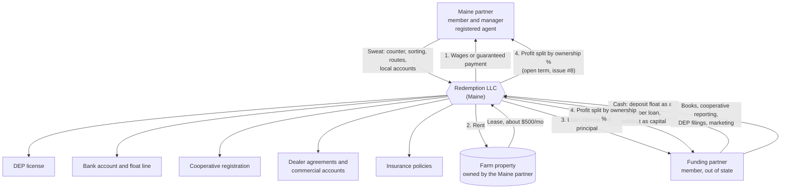

### Who holds what

The license, lease, and bank line sit with the LLC, not with either person.

```mermaid
flowchart TB
    MP["Maine partner<br/>member and manager<br/>registered agent"]
    FP["Funding partner<br/>member, out of state"]
    LLC{{"Redemption LLC<br/>(Maine)"}}
    FARM[("Farm property<br/>owned by the Maine partner")]

    MP -->|"Sweat: counter, sorting, routes,<br/>local accounts"| LLC
    FP -->|"Cash: deposit float as a member loan,<br/>buildout as capital"| LLC
    FP -->|"Books, cooperative reporting,<br/>DEP filings, marketing"| LLC
    FARM -->|"Lease, about $500/mo"| LLC

    LLC --> LIC[DEP license]
    LLC --> BANK[Bank account and float line]
    LLC --> COOPR[Cooperative registration]
    LLC --> ACCTS[Dealer agreements and<br/>commercial accounts]
    LLC --> INS[Insurance policies]

    LLC -->|"1. Wages or guaranteed payment"| MP
    LLC -->|"2. Rent"| FARM
    LLC -->|"3. Loan interest and principal"| FP
    LLC -->|"4. Profit split by ownership %<br/>(open term, issue #8)"| MP
    LLC -->|"4. Profit split by ownership %"| FP
```
