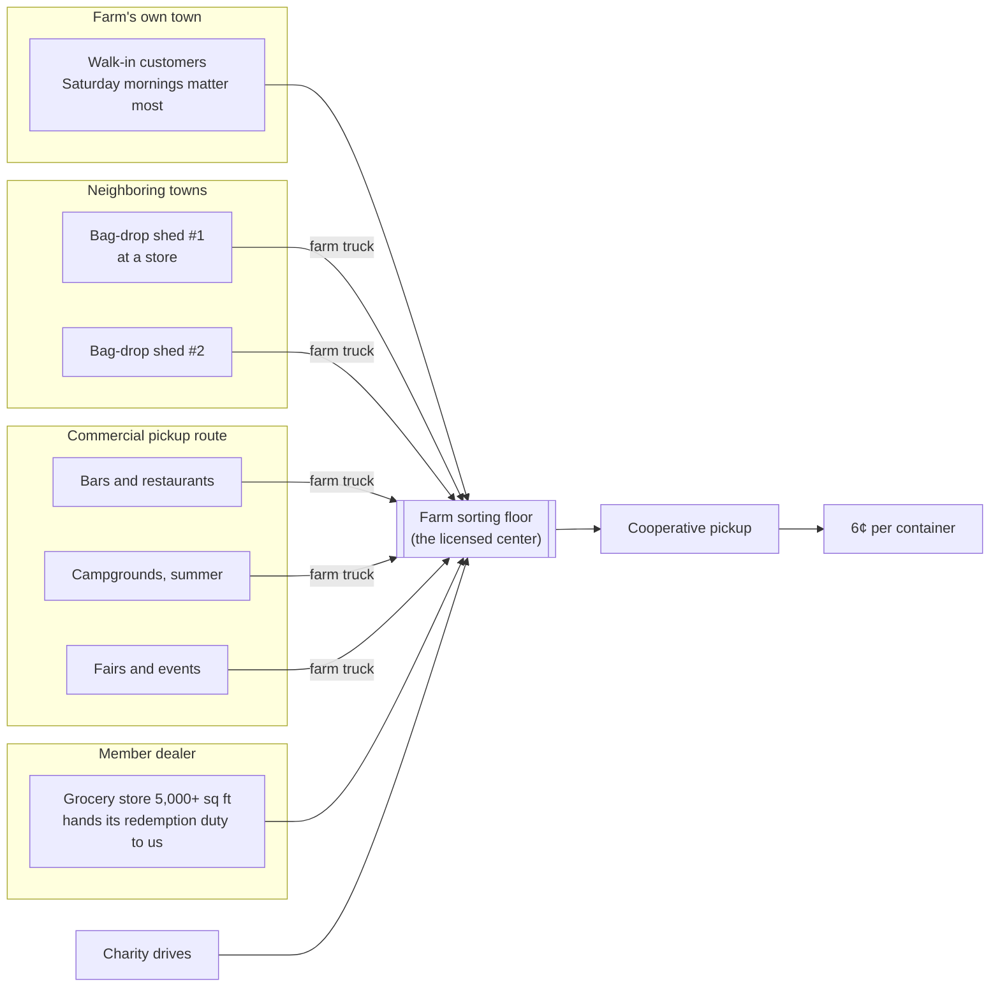

### How a rural site reaches enough volume

Maine redeems about 850 million containers a year across about 1.4 million people, roughly 600 per resident. Catching a third of local returns, 2 million containers a year needs about 10,000 people within reach. One small town is not enough, so volume has to be brought in (issue #6).

