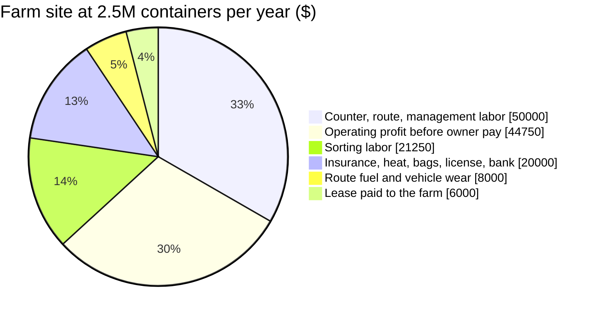

### Where the money goes at a farm site, 2.5 million containers a year

$150,000 in handling fees at 6¢.

```mermaid
pie showData
    title Farm site at 2.5M containers per year ($)
    "Counter, route, management labor" : 50000
    "Operating profit before owner pay" : 44750
    "Sorting labor" : 21250
    "Insurance, heat, bags, license, bank" : 20000
    "Route fuel and vehicle wear" : 8000
    "Lease paid to the farm" : 6000
```
