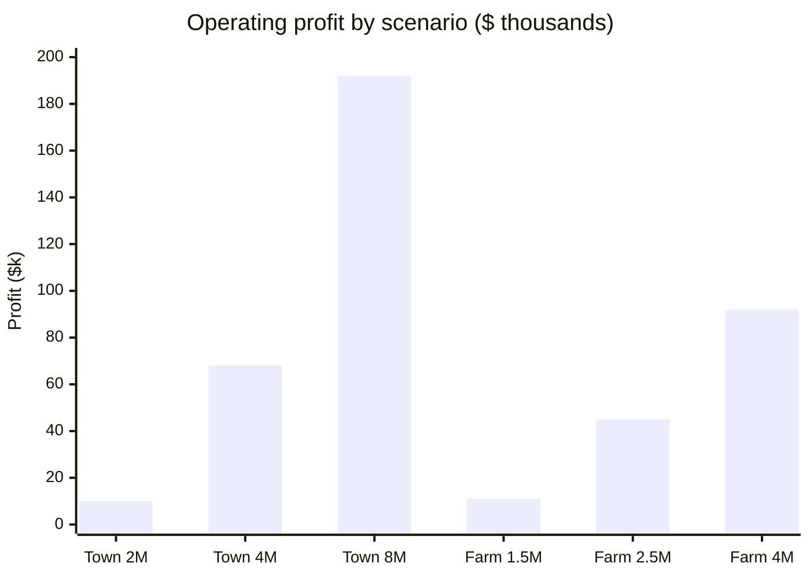

### Profit by site and volume

Operating profit before owner pay and tax, from the two tables in the plan. A farm site with a usable building beats a rented town site because there is no rent.

```mermaid
xychart-beta
    title "Operating profit by scenario ($ thousands)"
    x-axis ["Town 2M", "Town 4M", "Town 8M", "Farm 1.5M", "Farm 2.5M", "Farm 4M"]
    y-axis "Profit ($k)" 0 --> 200
    bar [10, 68, 192, 11, 45, 92]
```
