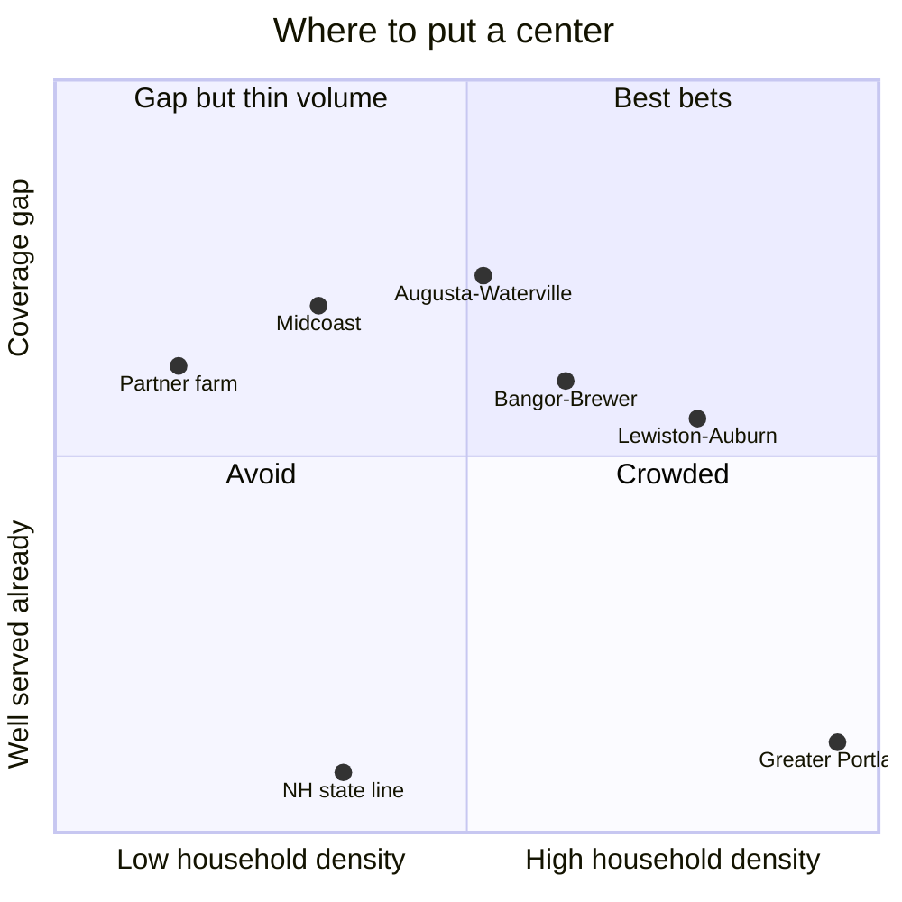

### Site ranking at a glance

A qualitative read of section 3 of the plan, not measured data.

```mermaid
quadrantChart
    title Where to put a center
    x-axis Low household density --> High household density
    y-axis Well served already --> Coverage gap
    quadrant-1 Best bets
    quadrant-2 Gap but thin volume
    quadrant-3 Avoid
    quadrant-4 Crowded
    Lewiston-Auburn: [0.78, 0.55]
    Bangor-Brewer: [0.62, 0.6]
    Augusta-Waterville: [0.52, 0.74]
    Midcoast: [0.32, 0.7]
    Partner farm: [0.15, 0.62]
    Greater Portland: [0.95, 0.12]
    NH state line: [0.35, 0.08]
```
