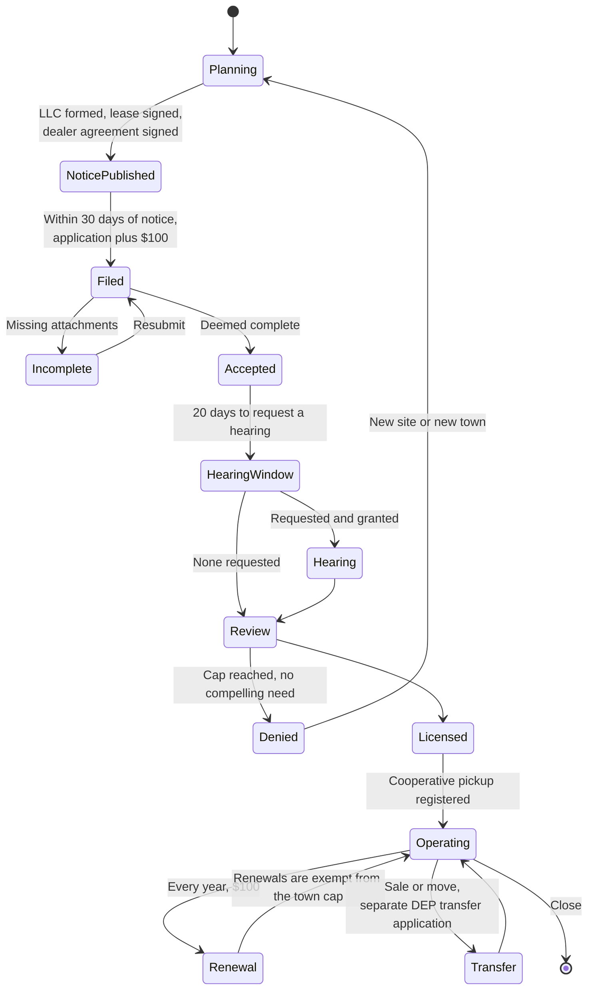

### License lifecycle

```mermaid
stateDiagram-v2
    [*] --> Planning
    Planning --> NoticePublished: LLC formed, lease signed,<br/>dealer agreement signed
    NoticePublished --> Filed: Within 30 days of notice,<br/>application plus $100
    Filed --> Incomplete: Missing attachments
    Incomplete --> Filed: Resubmit
    Filed --> Accepted: Deemed complete
    Accepted --> HearingWindow: 20 days to request a hearing
    HearingWindow --> Hearing: Requested and granted
    HearingWindow --> Review: None requested
    Hearing --> Review
    Review --> Denied: Cap reached, no compelling need
    Review --> Licensed
    Denied --> Planning: New site or new town
    Licensed --> Operating: Cooperative pickup registered
    Operating --> Renewal: Every year, $100
    Renewal --> Operating: Renewals are exempt from the town cap
    Operating --> Transfer: Sale or move,<br/>separate DEP transfer application
    Transfer --> Operating
    Operating --> [*]: Close
```
