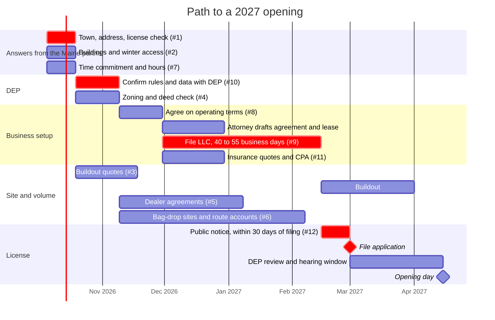

### Timeline to opening

A target schedule starting October 2026. Dates move once issue #1 is answered.

```mermaid
gantt
    title Path to a 2027 opening
    dateFormat YYYY-MM-DD
    axisFormat %b %Y

    section Answers from the Maine partner
    Town, address, license check (#1)        :crit, a1, 2026-10-05, 14d
    Buildings and winter access (#2)         :a2, 2026-10-05, 14d
    Time commitment and hours (#7)           :a3, 2026-10-05, 14d

    section DEP
    Confirm rules and data with DEP (#10)    :crit, d1, after a1, 21d
    Zoning and deed check (#4)               :d2, after a1, 21d

    section Business setup
    Agree on operating terms (#8)            :b1, after d1, 21d
    Attorney drafts agreement and lease      :b2, after b1, 30d
    File LLC, 40 to 55 business days (#9)    :crit, b3, after b1, 77d
    Insurance quotes and CPA (#11)           :b4, after b1, 30d

    section Site and volume
    Buildout quotes (#3)                     :s1, after a2, 30d
    Buildout                                 :s2, after b3, 45d
    Dealer agreements (#5)                   :s3, after d1, 60d
    Bag-drop sites and route accounts (#6)   :s4, after d1, 90d

    section License
    Public notice, within 30 days of filing (#12) :crit, l1, after b3, 14d
    File application                          :milestone, crit, l2, after l1, 0d
    DEP review and hearing window             :l3, after l1, 45d
    Opening day                               :milestone, l4, after l3, 0d
```
