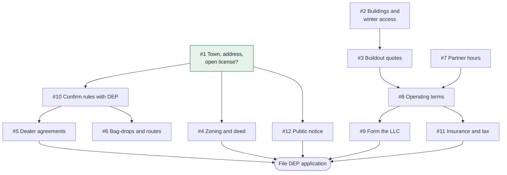

### How the open questions depend on each other

```mermaid
flowchart TD
    I1["#1 Town, address,<br/>open license?"]
    I2["#2 Buildings and<br/>winter access"]
    I3["#3 Buildout quotes"]
    I4["#4 Zoning and deed"]
    I5["#5 Dealer agreements"]
    I6["#6 Bag-drops and routes"]
    I7["#7 Partner hours"]
    I8["#8 Operating terms"]
    I9["#9 Form the LLC"]
    I10["#10 Confirm rules with DEP"]
    I11["#11 Insurance and tax"]
    I12["#12 Public notice"]
    FILE(["File DEP application"])

    I1 --> I10
    I1 --> I4
    I1 --> I12
    I2 --> I3
    I10 --> I5
    I10 --> I6
    I3 --> I8
    I7 --> I8
    I8 --> I9
    I8 --> I11
    I9 --> FILE
    I4 --> FILE
    I5 --> FILE
    I12 --> FILE
    I11 --> FILE

    classDef first fill:#E4F2EB,stroke:#0C6B4C,color:#1A2622
    class I1 first
```
