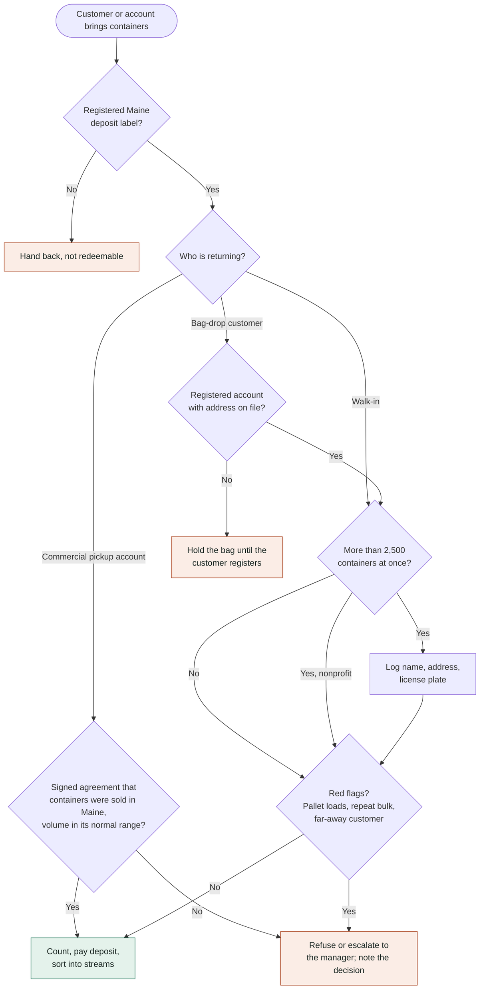

### Out-of-state container check at intake

Containers bought outside Maine carry a $100 fine per container for the center that accepts them, and returns over 2,500 containers need name, address, and plate.

