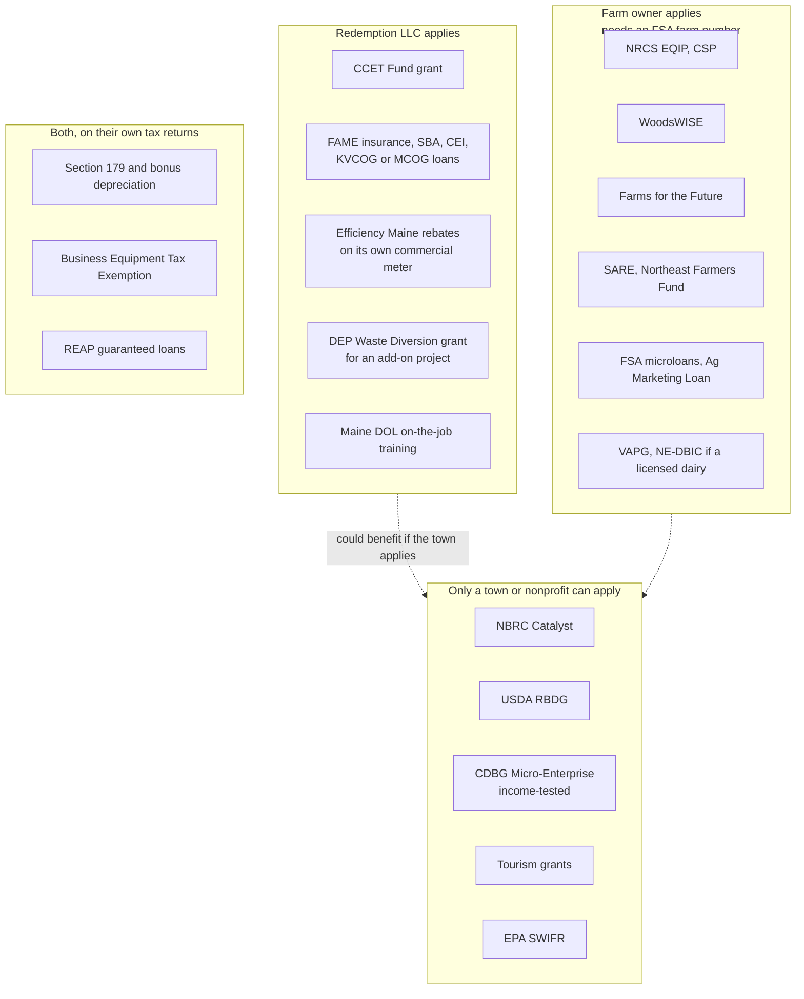
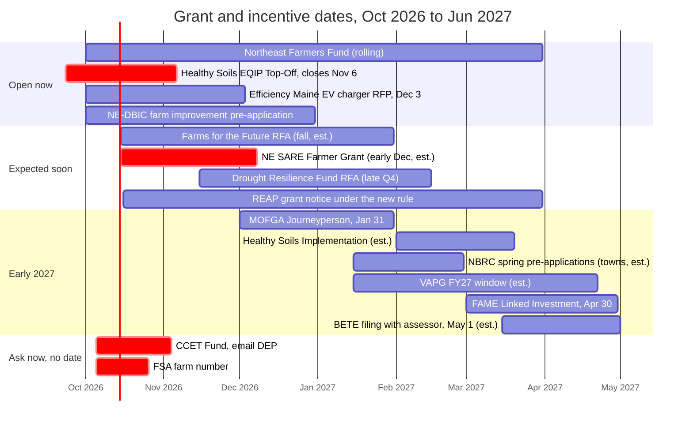
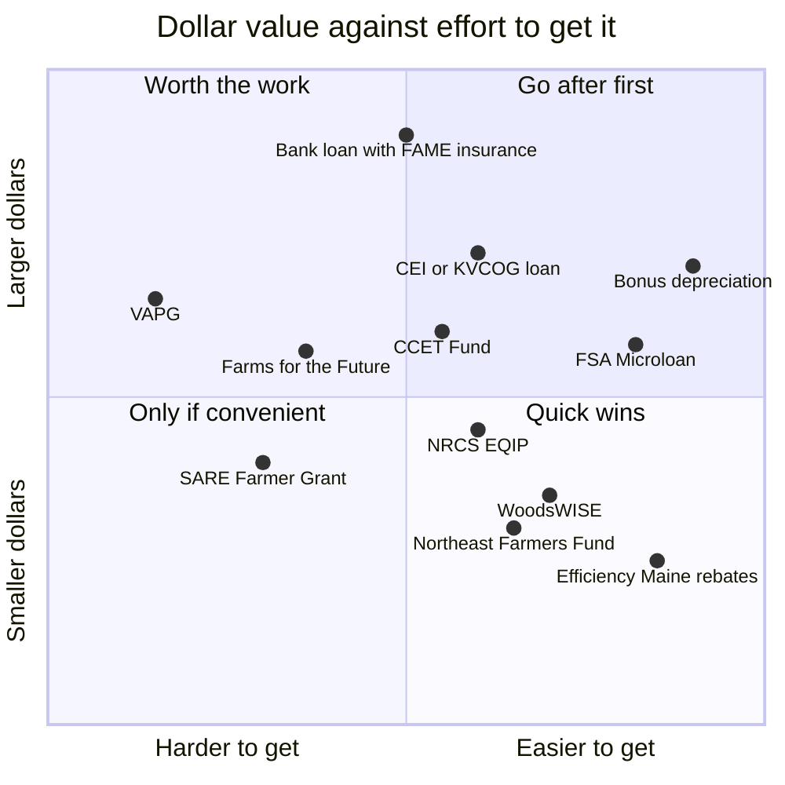
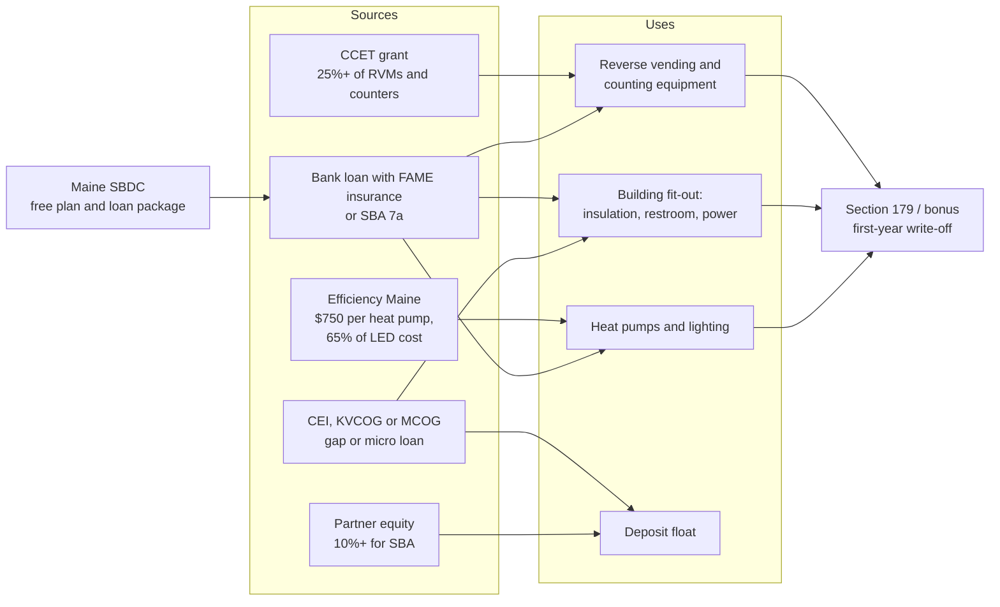

# Grants, loans, and incentives

Everything we found that could fund the redemption center, the farm, the side businesses, or the buildings and power behind them. Researched October 2026 across about 90 programs, with sources on every page.

| Page | Covers |
| --- | --- |
| [redemption-center.md](https://github.com/wbp318/maine-business-2027/blob/main/grants/redemption-center.md) | Recycling and bottle-bill money, reverse vending machine funding, waste grants |
| [farm-and-agriculture.md](https://github.com/wbp318/maine-business-2027/blob/main/grants/farm-and-agriculture.md) | NRCS, FSA, DACF, woodlot, dairy, and private farm funds |
| [small-business-and-rural.md](https://github.com/wbp318/maine-business-2027/blob/main/grants/small-business-and-rural.md) | Loans, guarantees, free advising, workforce, tourism, tax credits |
| [energy-and-buildings.md](https://github.com/wbp318/maine-business-2027/blob/main/grants/energy-and-buildings.md) | Efficiency Maine, REAP, depreciation, solar, line extensions, septic |

**(snippet)** marks a fact seen only in a search summary; **(est.)** marks our estimate or something not verified on the source. Grant rules change often; confirm with the agency before applying.

## The short version

1. **Real grants for a for-profit startup are rare.** Most grant programs (NBRC, EPA, USDA RBDG, tourism, CDBG) only fund towns and nonprofits. What's left for the LLC is mostly **loans, loan guarantees, rebates, tax write-offs, and free advising.**
2. **There is one grant written for this exact business.** Maine DEP's **CCET Fund** pays at least 25% of reverse vending machines and automated counting equipment for redemption centers. The pool was cut to $500k a year in 2025. Ask DEP when the next round opens.
3. **The farm has more grant options than the LLC.** These include NRCS EQIP cost-share, WoodsWISE for the woodlot, Farms for the Future, SARE farmer grants, and the Northeast Farmers Fund, which is open now. They need an FSA farm number first.
4. **Federal programs changed a lot in 2025–26:**
   - REAP grants were frozen and rewritten.
   - SBA loans now require every owner to be a U.S. citizen.
   - Most clean-energy tax credits were cut.
   - **100% bonus depreciation became permanent**, but Maine doesn't follow it.
5. **Start with the free help:** the Maine SBDC builds the plan and packages the loan, and Efficiency Maine does a free building consultation.

## Top 15 across everything

| # | Program | For | Type | Amount | Status (Oct 2026) |
| --- | --- | --- | --- | --- | --- |
| 1 | [CCET Fund](https://legislature.maine.gov/statutes/38/title38sec3114-A.html) (DEP) | LLC | **Grant** | At least 25% of RVMs and counting equipment | No round posted; ask DEP |
| 2 | [Maine SBDC](https://www.mainesbdc.org) | LLC | Free advising | Free | Rolling |
| 3 | [FAME Commercial Loan Insurance](https://famemaine.com/business-financing/for-lenders/commercial-loan-insurance/traditional-application) | LLC | Bank loan insurance | Up to 90% | Rolling |
| 4 | [CEI loans](https://www.ceimaine.org/financing/small-business-loans/) | LLC | Loan | Up to $1M; microloans | Rolling |
| 5 | [KVCOG](https://www.kvcog.org/business-services/business-financing) or MCOG loan fund | LLC | Loan | Up to $200k | Rolling; depends on county |
| 6 | Section 179 and 100% bonus depreciation | Both | Federal tax write-off | 100% first year | Permanent; Maine differs |
| 7 | [Efficiency Maine heat pumps](https://www.efficiencymaine.com/at-work/commercial-hvac-incentives/) | LLC | Rebate | $750 per outdoor unit (change of use) | Pre-approval required |
| 8 | [Efficiency Maine lighting](https://www.efficiencymaine.com/at-work/lighting-incentives/) | LLC | Rebate | 65% for small businesses | Open |
| 9 | [NRCS EQIP](https://nrcs-prod.azureedge.us/state-offices/maine/how-the-environmental-quality-incentives-program-works-in-maine) | Farm | **Cost-share** | About 50–90% per practice (est.) | Year-round; next ranking TBD |
| 10 | [WoodsWISE](https://www.maine.gov/dacf/mfs/policy_management/ww_resilience.html) | Farm | **Reimbursement** | Up to $20k at 60–90% | Rolling through 2029 |
| 11 | [Farms for the Future](https://www.maine.gov/dacf/ard/grants/farms-for-future/index.shtml) | Farm | **Grant**, then loan | $6k plan; then $25k grant plus 2% loan | RFA expected fall 2026 |
| 12 | [Northeast SARE Farmer Grant](https://www.sare.org/wp-content/uploads/Northeast-SARE-Farmer-Grant-Call-for-Proposals.pdf) | Farm | **Grant** | Up to $30k, no match | Likely early Dec 2026 (est.) |
| 13 | [Northeast Farmers Fund](https://wolfesneck.org/neff/) | Farm | **Grant** | Not posted | **Open now** |
| 14 | [FSA Microloan](https://www.fsa.usda.gov/resources/farm-loan-programs/microloans) | Farm | Loan | $50k | Year-round |
| 15 | [SBA 7(a) / 504](https://cdcnewengland.com/post/new-sba-citizenship-requirements-what-bankers-and-borrowers-need-to-know) | LLC | Loan guarantee | Up to $5M | All owners must be U.S. citizens |

## Who applies for what

The LLC and the farm owner are different applicants. Keep the redemption center in its own LLC so farm programs stay clean, and don't count on farm money for the center, storage, or campsites.

## Calendar

Known and expected dates from now through mid-2027. Dates marked (est.) in the pages are estimates; watch each agency's page.

## Size against effort

A qualitative placement of the main programs we'd realistically use.

## Paying for the redemption center

How the pieces could stack for the fit-out and equipment. It uses the plan's estimates: about $15k–40k for the building fit-out, plus equipment and a deposit float of about $10k.

## Changed or frozen in 2025–2026

| Program | Change | Page |
| --- | --- | --- |
| CCET Fund | Cut from $1M to $500k a year | [redemption-center](https://github.com/wbp318/maine-business-2027/blob/main/grants/redemption-center.md) |
| USDA REAP grants | Stopped March 2026; new rule effective Oct 16, 2026 pays only for projects finished 12–24 months earlier | [energy](https://github.com/wbp318/maine-business-2027/blob/main/grants/energy-and-buildings.md) |
| SBA 7(a), 504, Microloans | 100% U.S.-citizen ownership from March and April 2026 | [small business](https://github.com/wbp318/maine-business-2027/blob/main/grants/small-business-and-rural.md) |
| Bonus depreciation | 100% made permanent; Maine decoupled | [energy](https://github.com/wbp318/maine-business-2027/blob/main/grants/energy-and-buildings.md) |
| 179D, 25C/25D, 45L, EV charger credit | Ended or effectively closed in 2025–26 | [energy](https://github.com/wbp318/maine-business-2027/blob/main/grants/energy-and-buildings.md) |
| Solar credit (48E) | Must be in service by Dec 31, 2027 | [energy](https://github.com/wbp318/maine-business-2027/blob/main/grants/energy-and-buildings.md) |
| Grow Maine | Original $62M fully lent; only repayments re-lent | [small business](https://github.com/wbp318/maine-business-2027/blob/main/grants/small-business-and-rural.md) |
| EPA SWIFR and REO | No new community rounds | [redemption-center](https://github.com/wbp318/maine-business-2027/blob/main/grants/redemption-center.md) |
| Packaging EPR | Contractor search stalled; towns only anyway | [redemption-center](https://github.com/wbp318/maine-business-2027/blob/main/grants/redemption-center.md) |
| Agricultural Development Grant | Temporarily closed | [farm](https://github.com/wbp318/maine-business-2027/blob/main/grants/farm-and-agriculture.md) |
| Climate-Smart Commodities, Local Food Purchase | Cancelled 2025 (est.) | [farm](https://github.com/wbp318/maine-business-2027/blob/main/grants/farm-and-agriculture.md) |
| Federal Work Opportunity Tax Credit | Expired 12/31/2025 | [small business](https://github.com/wbp318/maine-business-2027/blob/main/grants/small-business-and-rural.md) |
| ETIF / Pine Tree Development Zones | Closed to new applicants after 2024 (snippet) | [small business](https://github.com/wbp318/maine-business-2027/blob/main/grants/small-business-and-rural.md) |

## Next actions

These are tracked as issues [#17](https://github.com/wbp318/maine-business-2027/issues/17) to [#22](https://github.com/wbp318/maine-business-2027/issues/22).

1. Email DEP about the next CCET round, and whether a center with a pending license can apply.
2. Apply to the Northeast Farmers Fund this month.
3. Get the farm's FSA number and open an NRCS application; ask for a forest plan.
4. Book Maine SBDC and Efficiency Maine consultations.
5. Start a SARE Farmer Grant proposal for early December.
6. Watch for the Farms for the Future fall RFA.
7. Have a CPA plan depreciation and the new building's primary use before building.
