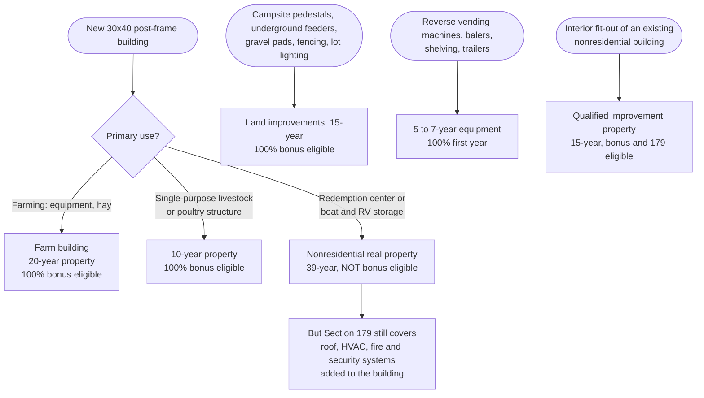

# Energy, buildings, and tax treatment

Incentives for fitting out the redemption center, a possible new building, campsite and storage-lot power, and farm loads like water heaters and poultry lighting. Researched October 2026. **(snippet)** marks a fact seen only in a search summary; **(est.)** marks our estimate or something not yet verified on the source.

## What changed in 2025–2026

| Change | What it means here |
| --- | --- |
| **100% bonus depreciation is permanent** (federal budget law, July 2025) for property acquired after Jan 19, 2025. Section 179 limit for 2026 is about $2.56M (snippet) | Equipment, fit-out, and site work can be written off in year one federally. **Maine decoupled from bonus depreciation**, so the state return differs; see [small-business-and-rural.md](https://github.com/wbp318/bottle_recycling_2027/blob/main/grants/small-business-and-rural.md) |
| **USDA REAP grants rewritten**: new rule effective Oct 16, 2026. Projects must be **finished 12–24 months before applying**, with a year of energy data before and after. Grant is at most 25%. New-construction efficiency is ineligible. No solar on cropland ([Federal Register 2026-20178](https://thefederalregister.org/documents/2026-20178/unleashing-american-energy-and-economic-prosperity-rural-energy-for-america-program-reap); [Solar Power World](https://www.solarpowerworldonline.com/2026/10/reap-grant-update-makes-solar-projects-on-farmland-ineligible/)) | Useless for the new fit-out, which has no baseline. Possibly useful later for a retrofit, after the fact |
| **Federal clean-energy credits cut back**: 179D ended for construction starting after June 30, 2026; 25C/25D ended Dec 31, 2025; solar under 48E must be **in service by Dec 31, 2027** ([Arnold & Porter](https://www.arnoldporter.com/en/perspectives/advisories/2025/07/from-ira-to-obbba-a-new-era-for-clean-energy-tax-credits), snippet) | If solar on a roof is wanted, it has a hard deadline |
| **Efficiency Maine Triennial Plan VI** (July 2025 – June 2028): budget falling, residential heat-pump money cut (snippet) | Commercial programs still run |
| **Maine net energy billing**: no new front-of-meter agreements after Dec 31, 2025; **behind-the-meter (rooftop) still credited** ([Maine Senate](https://www.mainesenate.org/new-balanced-reforms-to-net-energy-billing-program-to-take-effect/), snippet) | A small array on the farm's own meter is unaffected |
| Grid Upgrade grants for farms (Maine Jobs Plan) completed; DEP septic Small Community Grant 2026 round closed | Not available |

## Ranked

| # | Program | What it funds | 2026 amount | Who | Open? | Fit |
| --- | --- | --- | --- | --- | --- | --- |
| 1 | Section 179 and 100% bonus depreciation (IRS) | Equipment, building systems, land improvements | 100% first-year federal write-off | LLC and farm | Yes | **High** |
| 2 | [Efficiency Maine commercial heat pumps](https://www.efficiencymaine.com/at-work/commercial-hvac-incentives/) | Mini-splits, VRF, ERVs | **$750 per outdoor unit** for a change-of-use building; $1,000–2,000 for replacements | LLC on a commercial meter | Yes; pre-approval required | **High** |
| 3 | [Efficiency Maine small business lighting](https://www.efficiencymaine.com/at-work/lighting-incentives/) | LED interior and exterior | **65% of cost** for small businesses | LLC on a commercial meter | Yes | **High** |
| 4 | Business Equipment Tax Exemption (BETE) | Local property tax on business equipment | Exempts eligible equipment (est.) | LLC and farm | Annual filing with the assessor (est.) | **High** (est.) |
| 5 | Farm sales-tax exemptions (Maine Revenue Services) | Farm equipment; fuel and power used in farming | Full or partial exemption (est.) | Farm | Yes (est.) | Medium-High |
| 6 | [NRCS EQIP On-Farm Energy](https://www.nrcs.usda.gov/programs-initiatives/eqip-on-farm-energy-initiative) | Farm energy plan, then lighting, waterers, building envelope | Cost-share per practice (est.) | Farm | Rolling sign-up (est.) | Medium |
| 7 | [USDA REAP guaranteed loans](https://www.rd.usda.gov/programs-services/energy-programs/rural-energy-america-program-renewable-energy-systems-energy-efficiency-improvement-guaranteed-loans-me) | Efficiency and rooftop solar | Up to 75% of cost, 80% guarantee | LLC or farm | Year-round | Medium |
| 8 | REAP grants (new rule) | Completed projects, paid afterward | Up to 25%; $1,500 minimum | LLC or farm | Window not announced | Medium-Low |
| 9 | Federal 48E credit | Rooftop solar, batteries | 30% base (est.); solar in service by 12/31/2027 | Taxable entity | Yes, with deadline | Medium |
| 10 | Net energy billing, behind the meter | Bill credits for on-site solar | Per kWh | LLC or farm | Yes | Medium |
| 11 | [Efficiency Maine Small Business Energy Loans](https://www.efficiencymaine.com/small-business-energy-loans/) | Heat pumps, VRF | $2k–10k at 4.99% (snippet) | LLC | Yes | Medium |
| 12 | [C-PACE](https://www.efficiencymaine.com/c-pace/) | Long-term efficiency loan repaid through property tax | Varies | LLC | Only in towns that adopted it | Medium |
| 13 | CMP line extension (a cost, not an incentive) | Power to a new building or campsites | Overhead about $40.96/ft from 4/1/2026 (snippet) | Both | n/a | Medium |
| 14 | [Efficiency Maine public EV chargers RFP](https://www.efficiencymaine.com/rfp-em-008-2026/) | 4+ public Level 2 ports | Up to 80%, ≤$200k per site | LLC | Until Dec 3, 2026 or funds run out | Low-Medium |
| 15 | [Efficiency Maine Custom Program](https://www.efficiencymaine.com/at-work/commercial-industrial-custom-program/) | Site-specific projects | $10k minimum incentive | LLC | Yes | Low |
| 16 | [Commercial heat pump water heaters](https://www.efficiencymaine.com/at-work/water-heating-incentives/) | Large units | $1,800–3,000 | Certain building types only | Yes | Low |
| 17 | [DEP Small Community Grant](https://www.maine.gov/dep/water/grants/scgp.html) | Replacing a **failing** septic system | 25–50% | Via the town | 2026 round closed | Low |
| 18 | 179D deduction | Efficient commercial buildings | Small for a 1,200 sq ft building | LLC | Effectively closed | Low |
| 19 | [DEP brownfields](https://www.maine.gov/dep/spills/brownfields/) | Contamination assessment and cleanup | Free assessment in some regions (est.) | Mainly towns | Varies | Low |

USDA Section 504 home repair grants, 25C/25D, and 45L are homeowner programs and don't apply.

## Heat pumps for the redemption center

Efficiency Maine treats an unheated outbuilding converted to a new use as **new construction**, so expect **$750 per outdoor unit** ([program page](https://www.efficiencymaine.com/at-work/commercial-hvac-incentives/); [Feb 2026 training deck](https://www.efficiencymaine.com/docs/Efficiency-Maine-CIPI-AE-Education-Session-2-26-2026.pdf)).

| System | New construction | Early retirement | Retrofit |
| --- | --- | --- | --- |
| Single-zone mini-split | $750 per outdoor unit | $1,000 | $1,500 |
| Small business single-zone | — | $1,300 | $2,000 |
| VRF | $3–6/sq ft | $4.50–8.50/sq ft | $8–12/sq ft |
| ERV | $1.50–1.75/CFM | — | $2–2.50/CFM |

Rules that matter:

- **Get pre-approval before buying equipment.**
- The business must run **at least 8 months a year, including winter.** The redemption center qualifies; seasonal campsites don't.
- Heat pumps must heat the whole building or zone, with **no backup heat** in new construction. Electric resistance heat is allowed only where heat pumps can't reach, such as **a restroom**.
- A Qualified Partner must install, with a Manual J load calculation.
- **Open a separate commercial meter in the LLC's name.** The small-business rates need a commercial account averaging under 100 kW peak.

## How the write-off depends on the building's use

Plan the new building's primary use **before** building it (est., confirm with the CPA):

Maine's return treats bonus depreciation differently. Have the CPA model both returns.

## Power to new sites

CMP charges about **$40.96 per foot** for overhead single-phase line extension from April 1, 2026, and $31.52 per foot underground for CMP's portion (snippet) ([CMP Section 7](https://www.cmpco.com/documents/d/cmp/sect07)). Ways to cut the cost:

- Bring one service to a single meter or sub-panel, then run **customer-owned underground feeders** to campsite pedestals and storage lighting. Those count as 15-year land improvements.
- Maine law lets customers build private lines to utility standards ([35-A M.R.S. §314](https://legislature.maine.gov/statutes/35-a/title35-Asec314.html)).
- Later customers who connect to a line you paid for may share its cost (PUC Chapter 395).

## Septic, well, and water

There are effectively **no grants for a business's new septic system or well**. USDA Water & Waste grants go to public bodies, and Section 504 is for homeowners. Finance them with SBA, FAME, or a USDA B&I loan. Watch one rule: a restroom serving 25 or more people a day for 60 or more days a year can make the well a **regulated public water system** under the Maine CDC Drinking Water Program (est.).

## Order of operations

1. Open the LLC's own commercial meter at the redemption center.
2. Book Efficiency Maine's free business consultation; get heat-pump pre-approval before buying anything.
3. Decide the new building's primary use before building it.
4. Solar only if it's rooftop or behind the meter, and in service by December 31, 2027.
5. File for BETE with the town assessor and get the farm sales-tax exemption certificate (est.).
6. Ask NRCS about an EQIP farm energy plan for poultry lighting, waterers, and the barn envelope.
7. Get a CMP line-extension quote and compare it with one service plus private feeders.
