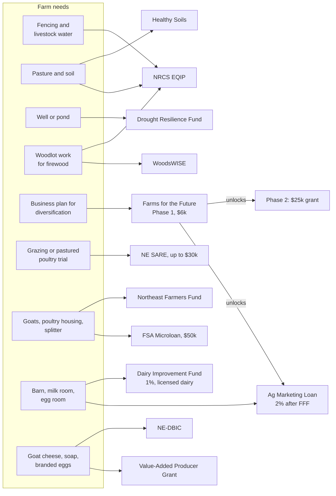

# Farm and agriculture

Grants, cost-share, and low-rate loans for the farm itself: goats, chickens, pasture, water, the woodlot, and value-added products. Researched October 2026. **(snippet)** marks a fact seen only in a search summary; **(est.)** marks our estimate or something not verified on the source.

**The non-farm businesses don't qualify for farm money.** Campsites, boat and RV storage, and the redemption center have to use [business financing](https://github.com/wbp318/maine-business-2027/blob/main/grants/small-business-and-rural.md).

## Do these first

1. **Get an FSA farm and tract number** at the USDA Service Center (Augusta for Kennebec, Belfast for Waldo; check which serves Knox and Lincoln). Bring the deed, tax ID, and a map. NRCS, FSA loans, and disaster programs all require it. Likely forms (est.):
   - AD-2047 customer record
   - CCC-902 farm operating plan
   - AD-1026 conservation compliance
   - CCC-941 income certification
2. **Ask NRCS, at the same office, for a conservation plan and a forest management plan.** Say so if the owner is a beginning or veteran farmer; those get higher rates and advance payments (est.).
3. **Register for a UEI on SAM.gov.** It's free, and federal grants require it.
4. **Write a simple business plan with real sales records.** Farms for the Future needs 2 years of commercial production; FSA loans and VAPG want a plan.
5. **Call the District Forester** for a free woodlot visit. That's step one for WoodsWISE.
6. **Sign up for DACF's Ag Grants News email list** and the NE-DBIC funding calendar.
7. **Settle licensing before chasing dairy money.** Goat dairy grants require commercial milk sales under a Maine milk license.

## Open now or due soon

| Program | Date | Action |
| --- | --- | --- |
| [Northeast Farmers Fund](https://wolfesneck.org/neff/) (Wolfe's Neck) | Opened Oct 1, 2026; rolling | **Apply this month** |
| [Healthy Soils EQIP Top-Off](https://www.maine.gov/dacf/ard/resources/healthysoils/index.shtml) (DACF) | Closes **Nov 6, 2026** | Only with an EQIP contract |
| [Farms for the Future](https://www.maine.gov/dacf/ard/grants/farms-for-future/index.shtml) (DACF) | RFA expected fall 2026 | Watch for it |
| [Northeast SARE Farmer Grant](https://www.sare.org/wp-content/uploads/Northeast-SARE-Farmer-Grant-Call-for-Proposals.pdf) | Likely early December 2026 (est.; last cycle closed Dec 9) | Start a proposal |
| [Farmers Drought Resilience Fund](https://www.maine.gov/dacf/ard/grants/farmers-drought-resilience-program.shtml) (DACF) | RFA late in Q4 2026 | Watch for it |
| [NE-DBIC Dairy Farm Improvement](https://www.nedairyinnovation.com/grants) | Pre-application Oct–Dec 2026 | Licensed goat dairy only |
| NRCS EQIP | FY27 first round passed Sept 18, 2026 | Apply anyway; it rolls to the next round |

## Ranked

| # | Program | Agency | Type | Amount / match | Fit |
| --- | --- | --- | --- | --- | --- |
| 1 | [EQIP](https://nrcs-prod.azureedge.us/state-offices/maine/how-the-environmental-quality-incentives-program-works-in-maine) | USDA NRCS | Cost-share | Fixed rate per practice, about 50–75%; up to about 90% for beginning or veteran farmers (est.) | **High** |
| 2 | [WoodsWISE Resilience](https://www.maine.gov/dacf/mfs/policy_management/ww_resilience.html) and [WoodsWISE Incentives](https://www.maine.gov/DACF/mfs/policy_management/wwi.html) | Maine Forest Service | Reimbursement | Up to $20,000 at 60% (90% for underserved landowners); forest plan cost-share about $500 (snippet) | **High** with 10+ wooded acres |
| 3 | [Maine Farms for the Future](https://www.maine.gov/dacf/ard/grants/farms-for-future/index.shtml) | DACF | Grant, then grant plus loan | Phase 1: $6,000 business plan. Phase 2: up to $25k grant plus up to $250k at 2% | **High** with 2+ years commercial |
| 4 | [Northeast SARE Farmer Grant](https://www.sare.org/wp-content/uploads/Northeast-SARE-Farmer-Grant-Call-for-Proposals.pdf) | USDA NIFA via UVM | Grant | Up to $30,000, no match | **High** |
| 5 | [Northeast Farmers Fund](https://wolfesneck.org/neff/) | Wolfe's Neck Center (USDA funds) | Grant | Not posted | Medium-High |
| 6 | [FSA Microloan](https://www.fsa.usda.gov/resources/farm-loan-programs/microloans) | USDA FSA | Loan | $50k operating, $50k ownership; capped at 5% for beginning and veteran farmers | **High** |
| 7 | [Agricultural Marketing Loan Fund](https://www.maine.gov/dacf/ard/grants/agricultural_marketing.shtml) | DACF and FAME | Loan | Up to $250k at prime or 5%, whichever is lower; 2% after Farms for the Future | Medium-High |
| 8 | [Healthy Soils](https://www.maine.gov/dacf/ard/resources/healthysoils/index.shtml) Implementation Grant and EQIP Top-Off | DACF | Grant | Up to $65k; needs $2,000 a year in farm sales | Medium |
| 9 | [Farmers Drought Resilience Fund](https://www.maine.gov/dacf/ard/grants/farmers-drought-resilience-program.shtml) | DACF | Grant | 2026 awards $15k–50k for wells and ponds | Medium |
| 10 | [Value-Added Producer Grant](https://www.farmers.gov/sites/default/files/documents/rd-value-added-producer-grant-2026-04.pdf) | USDA RD | Grant | Planning up to $50k; working capital up to $200k; 1:1 match | Medium |
| 11 | [NE-DBIC dairy grants](https://www.nedairyinnovation.com/grants) | NE Dairy Business Innovation Center | Grant | Not posted | Medium if a licensed goat dairy |
| 12 | [Dairy Improvement Fund](https://www.famemaine.com/business-financing/for-business-owners/fame-financing-programs/direct-loan-programs/agricultural-loans/dairy-improvement-fund/) | DACF and FAME | Loan | 1% fixed, up to $250k; explicitly includes goats | Medium if a licensed goat dairy |
| 13 | [FSA direct and guaranteed loans](https://www.fsa.usda.gov/sites/default/files/2025-11/FSA_farm_loan_info_chart%20%282%29.pdf) | USDA FSA | Loan | Operating $400k; ownership $600k | Medium |
| 14 | [MOFGA Journeyperson](https://www.mofga.org/?p=602) | MOFGA | Training plus stipend | $200 stipend plus paid mentor; due Jan 31 | Medium |
| 15 | [Farmer Veteran Coalition Fellowship Fund](https://farmvetco.org/fvfellowship/) | FVC / Tractor Supply | Grant (in equipment) | $1,000–5,000 | High if a veteran |
| 16 | CSP | USDA NRCS | Annual payments | 5-year contract | Low-Medium |
| 17 | FSA Farm Storage Facility Loan | USDA FSA | Loan | Low rate (est.) | Low-Medium |
| 18 | [Linked Investment Program for Agriculture](https://famemaine.com/business-financing/for-business-owners/fame-financing-programs/direct-loan-programs/agricultural-loans/linked-investment-program-for-agriculture) | FAME / Treasurer | Rate cut | Up to 2% off an operating loan; reserve by Apr 30 | Low-Medium (needs farming as main income) |
| 19 | [Maine Farmland Trust](https://mainefarmlandtrust.org/blogs/farming-for-wholesale-helps-farms-scale-up) programs | MFT | Advising plus grant | Up to $50k (wholesale track) | Low-Medium |
| 20 | [PFAS Fund](https://www.maine.gov/dacf/ag/pfas/pfas-fund.shtml) | DACF | Income replacement, infrastructure, testing | Up to 24 months of income | Only if PFAS-affected |
| 21 | RCPP | USDA NRCS | Cost-share via partners | Varies | Low |
| 22 | REAP | USDA RD | **Grants frozen**; guaranteed loans open | See [energy page](https://github.com/wbp318/maine-business-2027/blob/main/grants/energy-and-buildings.md) | Low |
| 23 | [LAMP](https://www.ams.usda.gov/services/grants/lamp) | USDA AMS | Grant | Mostly for organizations | Low |

**Doesn't apply:**

| Program | Why | Source |
| --- | --- | --- |
| Agricultural Development Grant | **Temporarily closed** since 2023. A third-party listing claims an October 2026 deadline, but DACF's page says closed. | [DACF](https://www.maine.gov/dacf/ard/grants/agricultural_development.shtml) |
| AIIP | Won't reopen. Its successor (AFFPIF) targets processing infrastructure and has no posted rounds. | [DACF](https://www.maine.gov/dacf/ard/grants/affp-infrastructure-fund.shtml) |
| Specialty Crop Block Grant | Single-farm projects are ineligible, and goat milk, eggs and firewood aren't specialty crops | [DACF](https://www.maine.gov/dacf/ard/grants/usda_specialty_crop.shtml) |
| Rural Rehabilitation Trust Fund | Beef cattle only | [DACF](https://www.maine.gov/dacf/ard/grants/rural_rehabilitation_trust_fund.shtml) |
| Beginning Farmer and Rancher Development | Grants go to organizations, not farms | |
| Farm Aid | Emergency help only, through partners | [Farm Aid](https://www.farmaid.org/our-work/family-farm-disaster-fund/) |

## What each program would pay for on this farm

## Notes on the top picks

**EQIP** pays a fixed rate per practice: fencing, watering pipelines and tanks, heavy-use areas, prescribed grazing, high tunnels, and woodlot practices like stand improvement and trails. Maine splits money into local pools. It continues after the 2025 budget law moved unspent IRA conservation money into the regular baseline (est.) ([Maine deadlines](https://nrcs-prod.azureedge.us/state-offices/maine/maines-application-deadlines)).

**WoodsWISE Resilience** reimburses eight forestry practices, including thinning, crop-tree release, planting, and invasive control. It runs through December 2029 or until the $9M is spent. A forest plan also opens NRCS forestry practices and possibly Tree Growth tax status (est.), but check the current-use question in [issue #13](https://github.com/wbp318/maine-business-2027/issues/13) first.

**Farms for the Future**:

- **Who qualifies:** for-profit Maine farms with **2+ years of commercial production** of food, fiber, or horticulture. Timber doesn't count. The applicant must own the land or a stake in the entity that owns it.
- **Phase 2:** the cash grant requires a 7-year protection agreement on 5+ acres.
- **Why it's worth it:** it's built for diversification planning, and Phase 1 unlocks the 2% loan rate.

**SARE Farmer Grants** fund farmer-led on-farm trials with an advisor and outreach to other farmers. About 40% are funded, there's no match, and it's paid by reimbursement. A goat rotational-grazing or pastured-poultry trial fits.

**FSA Microloan** suits buying goats, poultry housing, fencing, or a wood splitter. FSA's direct rate was 4.75% in March 2026 (snippet).

## Changed in 2025–2026

| Item | Status |
| --- | --- |
| REAP grants | Stopped March 31, 2026; new rule effective Oct 16, 2026 pays only after completion ([NSAC](https://sustainableagriculture.net/blog/release-usda-halts-rural-energy-efficiency-investments/)) |
| Farm bill | Would raise microloans to $100k and direct loans to $750k/$850k. The House passed its version Apr 30, 2026, and the Senate Ag Committee advanced its version in September. Not yet law |
| Climate-Smart Commodities | Cancelled April 2025 (est.); replaced by Advancing Markets for Producers, which funds the Northeast Farmers Fund |
| Local Food Purchase Assistance, Local Food for Schools | Cancelled March 2025 (est.) |
| LAMP | Survived proposed FY2026 cuts |
| NE-DBIC | Awarded $3.45M in Feb 2026; waiting on the next round for 2027 grants |

## Poultry and goats: certifications, not grants

- **NPIP** is required to sell hatching eggs or chicks across state lines. Contact AnimalHealth.AGR@maine.gov, 207-287-3701 ([DACF poultry](https://www.maine.gov/dacf/ahw/animal_health/poultry/index.shtml)).
- **Maine Milk Commission** handles cow-dairy pricing and isn't a source of money for goats (est.).
- **Free listings** for agritourism: Open Farm Day, Maine Maple Sunday, and DACF's Real Maine directory (est.).
