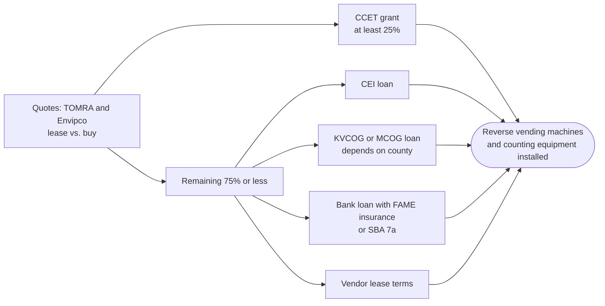

# Grants and financing for the redemption center

Money specifically for the redemption center LLC: its equipment, building fit-out, and working capital. Researched October 2026. **(snippet)** marks a fact seen only in a search summary; **(est.)** marks our estimate.

## The headline: the CCET Fund

Maine DEP's **Cost and Carbon Efficient Technology (CCET) Fund** is the one grant written for this business ([38 M.R.S. §3114-A](https://legislature.maine.gov/statutes/38/title38sec3114-A.html)).

- **What it pays for:** leasing or buying "automated beverage container counting, compacting and sorting systems," including **reverse vending machines**. It also covers installation: electrical upgrades, building changes, and the internet connection to the central system administrator.
- **How much:** each grant covers **at least 25%** of the expected cost. The fund is paid from unclaimed deposits through the commingling cooperative.
- **Changed in 2025:** the annual payment into the fund was cut from $1,000,000 to **$500,000** ([LD 1564, PL 2025 c.241](https://legislature.maine.gov/legis/bills/getPDF.asp?item=3&paper=HP1022&snum=132)). With that pool, expect modest awards (est.).
- **Who can apply:** "persons," which includes private businesses. There's no preference for small or rural centers.
- **When:** no open solicitation was posted in October 2026 ([DEP RFP page](https://www.maine.gov/dep/rfp/index.html)). Testimony in April 2025 refers to past applicants ([TOMRA testimony](https://legislature.maine.gov/testimony/resources/ENR20250422Noel133898352864700095.pdf)), so rounds do run. Ask DEP: BottleBill.DEP@maine.gov, 207-557-3218.
- **Why now:** full commingling started October 1, 2026. Centers sort by material instead of brand, and centers using reverse vending machines or bulk processing don't have to sort glass by color.

## Ranked

| Rank | Program | Type | LLC eligible directly? | Next deadline | Fit |
| --- | --- | --- | --- | --- | --- |
| 1 | [CCET Fund](https://legislature.maine.gov/statutes/38/title38sec3114-A.html), Maine DEP | **Grant**, at least 25% of equipment cost | Yes | Not posted; ask DEP | **High** |
| 2 | [CEI loans](https://www.ceimaine.org/financing/small-business-loans/) | Loan | Yes | Rolling | High |
| 3 | [FAME Commercial Loan Insurance](https://www.famemaine.com/business/) | Insurance on a bank loan | Yes, through the bank | Rolling | High |
| 4 | [KVCOG Revolving Loan Fund](https://kvcog.org/business-financing/interested-in-applying) | Loan up to $200k | Kennebec, Somerset, western Waldo | Rolling | High in its area |
| 5 | MCOG and EMDC regional loan funds | Loan | Knox, Lincoln, Waldo | Rolling | Medium-High |
| 6 | SBA 7(a), 504, Microloan | Loan guarantee or loan | Yes, if all owners are U.S. citizens | Rolling | Medium-High |
| 7 | [Efficiency Maine small business](https://www.efficiencymaine.com/at-work/small-business/) | Rebates, 4.99% loans | Yes | Rolling | Medium |
| 8 | [DEP Solid Waste Diversion Grant](https://www.maine.gov/dep/sustainability/compost/grant.html) | **Grant**, 25% match | Yes ("Maine businesses") | 2026 Round I closed April 13; fall round unconfirmed | Medium |
| 9 | USDA Rural Business Development Grant | Grant | **No** (towns and nonprofits) | FY26 closed June 2026 | Low-Medium |
| 10 | [CDBG Economic Development](https://maine.gov/decd/community-development/cdbg-program/grant-categories/economic-development-program) / Micro-Enterprise | Grant or loan via a town | **No** (town applies) | Monthly letters of intent | Low-Medium |
| 11 | [USDA REAP](https://www.rd.usda.gov/media/file/download/usda-rd-reap-faq-03312026.pdf) | Grant or loan guarantee | Yes, but **grants frozen** | No FY26 grant notice | Low |
| 12 | USDA B&I loan guarantee | Loan guarantee | Yes, through a bank | Rolling | Low |
| 13 | [MBRG refillable-container fund](https://www.maine.gov/dep/sustainability/bottlebill/documents/Plan%20final%2004102026_ADA%20SG.pdf) | Grant or contract | Unclear | 2026 money went to a study RFP | Low |
| 14 | [NBRC Catalyst](https://www.nbrc.gov/content/catalyst) | Grant | **No** (explicitly) | Spring 2027 pre-apps, likely late Feb (est.) | Low |
| 15 | [EPA SWIFR](https://www.epa.gov/infrastructure/solid-waste-infrastructure-recycling-grant-program) | Grant | **No** (governments only) | No new community round | Low |
| 16 | [EPA Recycling Education and Outreach](https://www.epa.gov/rcra/recycling-education-and-outreach-program) | Grant | **No** | Closed, restructured | Low |
| 17 | Maine packaging EPR | Reimbursement | **No** (towns only) | First payments late 2027 at the earliest | Low |
| 18 | Industry funders (Recycling Partnership, CMI, Closed Loop) | Grant or loan | Built for sorting plants and $3–5M projects | Invitation only | Low |
| 19 | [Maine Technology Institute](https://www.mainetechnology.org/) | Grant or loan | Only for R&D or new technology | Rolling | Low |
| 20 | [Lincoln County and LCRPC grants](https://www.lcrpcmaine.gov/economic-community-development) | Grant | **No** (towns and nonprofits) | Fall | Low |

## Details worth knowing

**CEI.** Business loans up to $1M. Its Wicked Fast microloans are reported at up to $15k for startups and $30k for existing businesses (snippet; another source says $25k). CEI's 7(a) arm goes up to $5M. 60% of its fiscal 2025 loans went to rural businesses ([CEI 2026 update](https://www.ceimaine.org/news-and-events/news/2026/01/12-months-of-impact-cei-increases-access-to-capital-opportunity-in-maine-and-across-the-u-s/), snippet).

**FAME loan insurance.** Covers up to 90% on traditional applications. The online platform covers **60% for startups** open less than a year, up to $1M of FAME exposure (snippet).

**KVCOG Revolving Loan Fund** ([apply](https://kvcog.org/business-financing/interested-in-applying)):

- **Amount and terms:** up to $200k (larger case by case), fixed rates, terms up to 15 years.
- **Requirements:** a written business plan, collateral, a real cash equity injection, and proof that conventional lenders won't do it on reasonable terms.
- **Contact:** loans@kvcog.org.

**MCOG.** Business loans up to $200k; microloans up to $50k; USDA RMAP microloans for businesses with 10 or fewer employees. MCOG is also a Grow Maine lender (snippet). Beware: a "Knox County RLF" term sheet online is for Knox County, **Ohio**.

**DEP Solid Waste Diversion Grant** ([2026 announcement](https://content.govdelivery.com/accounts/MEDEP/bulletins/40b7f38)):

- **Size:** 2026 Round I awarded $1k–$25k from a $165k pool; 2025 awards went up to $50k.
- **Who gets priority:** municipal and regional projects.
- **Our best angle:** handling fees already pay for deposit containers, so pitch an add-on, such as a non-deposit recycling or reuse drop-off at the farm, or composting with the farm's animals (est.).
- **Contact:** Mark King, mark.a.king@maine.gov, 207-592-0455.

**NBRC match by county, if a town partner ever applies** ([2026 county list](https://www.nbrc.gov/sites/default/files/2026-06/NBRC%202026%20County%20Community%20Static%20List.pdf)): Kennebec, Knox and Lincoln are "transitional" (50% match); Waldo is "distressed" (20% match).

## Paying for reverse vending machines

TOMRA serves about 60 Maine sites, including bulk-feed machines at centers in Lewiston and Winslow, and also runs CLYNK ([testimony](https://legislature.maine.gov/legis/bills/getTestimonyDoc.asp?id=197131)). TOMRA and Envipco typically offer leases (est.), and CCET explicitly covers leasing. Reverse vending machines must be described in the DEP license application (Section 2).

## Changed in 2025–2026

| Program | Change | Source |
| --- | --- | --- |
| CCET Fund | Annual funding cut from $1M to $500k | [LD 1564](https://legislature.maine.gov/legis/bills/getPDF.asp?item=3&paper=HP1022&snum=132) |
| Cooperative (MBRG) | Full commingling from October 1, 2026; LD 2036 to change it died April 6, 2026 | [DEP bottle bill](https://www.maine.gov/dep/sustainability/bottlebill/) |
| USDA REAP | No new grant awards until rules are rewritten; guaranteed loans continue | [USDA FAQ, March 2026](https://www.rd.usda.gov/media/file/download/usda-rd-reap-faq-03312026.pdf), [Grist](https://grist.org/food-and-agriculture/usda-abruptly-cancels-rural-energy-grant-application-window/) |
| EPA SWIFR | Kept, but no new community round; authority ends with FY26 | [Resource Recycling](https://resource-recycling.com/recycling/2026/01/05/epa-awards-58m-for-waste-recycling-infrastructure/) |
| EPA REO | Round 2 became a single coalition award | [Waste Dive](https://www.wastedive.com/news/federal-grants-funding-pause-cancellation-trump-compost-recycling/748641/) |
| NBRC | Proposed for elimination; Congress funded $60.5M for 2026 | [Sen. Hassan](https://www.hassan.senate.gov/news/press-releases/senator-hassan-statement-on-trump-budget-proposal-to-eliminate-northern-border-regional-commission) |
| Packaging EPR | Circular Action Alliance won't bid on Maine's contract (Aug 2026) | [Resource Recycling](https://resource-recycling.com/policy-now/2026/08/19/circular-action-alliance-wont-bid-on-maines-pro-contract/) |
| SBA loans | 100% U.S.-citizen ownership since March 1, 2026 | [CDC New England](https://cdcnewengland.com/post/new-sba-citizenship-requirements-what-bankers-and-borrowers-need-to-know) |

## Next steps

1. Email BottleBill.DEP@maine.gov: when does the next CCET round open, and can a center with a pending license apply?
2. Settle the county (issue #1). It decides KVCOG versus MCOG or EMDC.
3. Get lease and purchase quotes from TOMRA and Envipco to size the CCET request.
4. Sign up for DEP's RFP email alerts so the next Waste Diversion round isn't missed.
