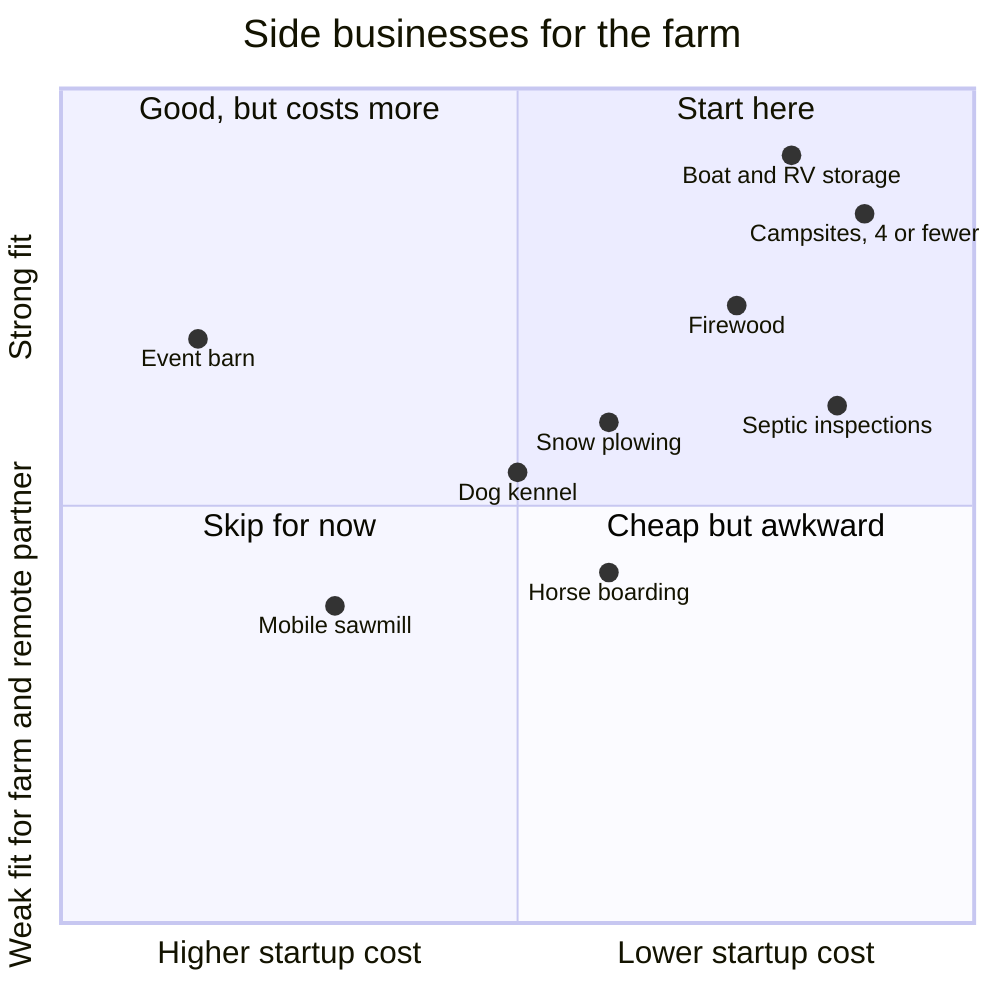
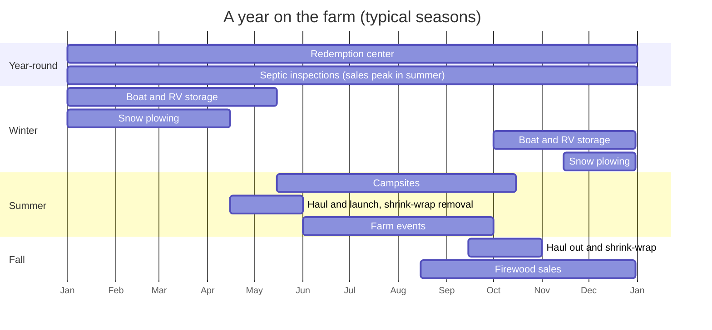
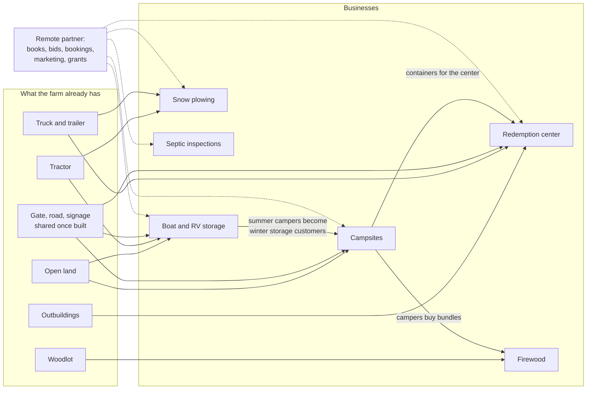

# Other low-cost businesses for the Maine farm

The redemption center works because the law sets the fee and guarantees the demand, while the capital needed is small. This folder looks for other businesses with the same traits that could run on, or alongside, the Maine partner's farm (goats and chickens, about 1.5 hours south of Orono, likely Kennebec, Knox, Waldo or Lincoln County).

We screened for:

- Startup cost under about $50k, ideally under $25k
- Revenue from a regulation, a state program, a contract, or a recurring need
- Work one local partner can do part-time, with the remote partner handling books, bids, bookings and marketing
- A fit with Maine's conditions: the short boating season, summer tourism, long winters, forestry, and shoreland property sales

Researched October 2026. Every regulatory fact links to a source. Figures marked **(est.)** are our planning estimates. Figures marked **(snippet)** came from a search summary of a page we couldn't read in full, so verify them before relying on them.

## Ranked shortlist

| Rank | Idea | Startup (est.) | Where demand comes from | State license | Farm fit | Remote-partner fit |
| --- | --- | --- | --- | --- | --- | --- |
| 1 | [Winter boat and RV storage](https://github.com/wbp318/maine-business-2027/blob/main/ideas/boat-rv-storage.md) | $5k–25k | Short boating season; RVs sit idle all winter | None found; town zoning only | Excellent | Excellent |
| 2 | [Small campground or RV sites](https://github.com/wbp318/maine-business-2027/blob/main/ideas/campground.md) | $2k–10k (4 sites), $25k–50k+ (5–24) | Summer tourism | None at 4 or fewer sites; ME CDC license at 5+ ($205/yr) | Excellent | Excellent |
| 3 | [Shoreland septic inspections](https://github.com/wbp318/maine-business-2027/blob/main/ideas/septic-inspections.md) | $3k–10k | **Required by statute** at every shoreland property sale | DHHS inspector certification | Neutral (labor only) | Good |
| 4 | [Firewood](https://github.com/wbp318/maine-business-2027/blob/main/ideas/firewood.md) | $5k–25k ($50k+ with a certified kiln) | Heating, campgrounds; the out-of-state firewood ban favors local wood | None to sell; must be sold by the cord | Very good | Good |
| 5 | [Snow plowing contracts](https://github.com/wbp318/maine-business-2027/blob/main/ideas/snow-plowing.md) | $8k–20k on an existing truck | Town and school bids, often multi-year | None found; insurance set by contract | Good | Good |
| 6 | [Dog boarding kennel](https://github.com/wbp318/maine-business-2027/blob/main/ideas/other-farm-ideas.md#dog-boarding-kennel) | $10k–40k | Vacations, tourist season | DACF kennel license, $125/yr | Good | Fair |
| 7 | [Horse boarding and hay](https://github.com/wbp318/maine-business-2027/blob/main/ideas/other-farm-ideas.md#horse-boarding-and-hay) | $5k–30k | Monthly board | None found | Depends on barns and pasture | Fair |
| 8 | [Agritourism and farm events](https://github.com/wbp318/maine-business-2027/blob/main/ideas/other-farm-ideas.md#agritourism-and-farm-events) | $5k–50k+ | Tourism; state law limits liability | Event camping license; change of use for barns | Very good | Very good |
| 9 | [Mobile sawmill](https://github.com/wbp318/maine-business-2027/blob/main/ideas/other-farm-ideas.md#mobile-sawmill) | $15k–40k | Local custom milling | Forest Service reporting | Good | Fair |
| 10 | [Grants](https://github.com/wbp318/maine-business-2027/blob/main/grants/README.md) (own folder) | about $0 | About 90 programs researched | n/a | n/a | Excellent |

Checked and not recommended: solar leases, septage hauling, e-waste, packaging EPR, mattresses, tires, and composting for tipping fees. See [not-recommended.md](https://github.com/wbp318/maine-business-2027/blob/main/ideas/not-recommended.md).

## Startup cost against fit

A qualitative placement using the ranges and fit ratings in the table above.

## How they fill the year

The redemption center runs year-round. The side businesses earn in different seasons, so together they keep the farm's income and the partner's time level.

## How the businesses share the farm

## Recommended order

1. **Boat and RV storage plus up to four campsites.** They use the same land, gate and cameras, need no state license at that size, and cover both seasons.
2. **Plowing contracts and firewood bundles.** They use the farm's equipment and fill the gaps between seasons.
3. **Septic inspection certification**, if the partner wants a second business whose demand is set by law, like the redemption center.

## Check these before using any land

These are tracked as issues [#13](https://github.com/wbp318/maine-business-2027/issues/13), [#14](https://github.com/wbp318/maine-business-2027/issues/14), and [#16](https://github.com/wbp318/maine-business-2027/issues/16). Prices to verify are in [#15](https://github.com/wbp318/maine-business-2027/issues/15).

- **Current-use tax.** If the farm is enrolled in Maine's Farmland current-use program, converting enrolled acres to commercial use can trigger a withdrawal penalty of about five years of tax savings plus interest ([36 M.R.S. §1112-C](https://legislature.maine.gov/statutes/36/title36sec1112-C.pdf)). Keep new uses off enrolled acres, or carve them out first.
- **Sludge and PFAS history.** Maine banned spreading sewage sludge on land in 2022 because of PFAS ([NACWA](https://www.nacwa.org/news-publications/news-detail/2022/04/20/maine-legislature-passes-bill-prohibiting-land-application-of-biosolids-governor-expected-to-sign)). Ask whether sludge was ever spread on this farm; contamination would affect every land-based idea.
- **Town zoning.** Storage, camping, events and kennels are all local land-use questions. Start with the code enforcement officer.

## Files

| File | Covers |
| --- | --- |
| [boat-rv-storage.md](https://github.com/wbp318/maine-business-2027/blob/main/ideas/boat-rv-storage.md) | Winter boat and RV storage |
| [campground.md](https://github.com/wbp318/maine-business-2027/blob/main/ideas/campground.md) | Campsites, RV sites, glamping, event camping |
| [septic-inspections.md](https://github.com/wbp318/maine-business-2027/blob/main/ideas/septic-inspections.md) | Inspections required at shoreland property sales |
| [firewood.md](https://github.com/wbp318/maine-business-2027/blob/main/ideas/firewood.md) | Seasoned and heat-treated firewood |
| [snow-plowing.md](https://github.com/wbp318/maine-business-2027/blob/main/ideas/snow-plowing.md) | Town, school and commercial plowing bids |
| [other-farm-ideas.md](https://github.com/wbp318/maine-business-2027/blob/main/ideas/other-farm-ideas.md) | Kennel, horse boarding, agritourism, mobile sawmill |
| [grants.md](https://github.com/wbp318/maine-business-2027/blob/main/ideas/grants.md) | Pointer to the grants folder |
| [not-recommended.md](https://github.com/wbp318/maine-business-2027/blob/main/ideas/not-recommended.md) | Ideas we checked and set aside, and why |
