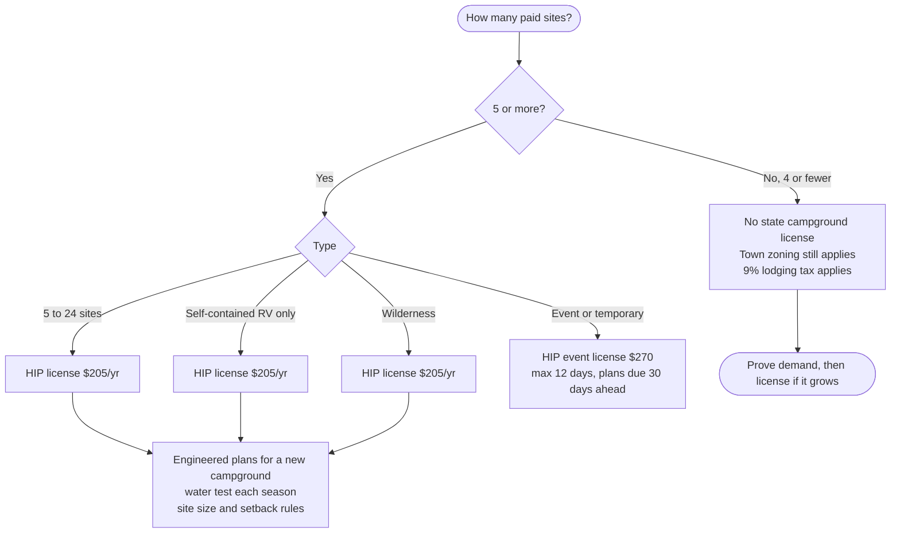

# Campsites, RV sites, and glamping

**Rank 2.** Pairs with winter storage: the same land earns in summer.

## What it is

Tent, RV, or glamping sites rented by the night or the season. Event camping for weddings or festivals is a separate license type.

## The license line: 4 sites vs. 5

Maine defines a campground as **5 or more sites** offered for compensation, including rental cabins ([22 M.R.S. §2491–2492](https://legislature.maine.gov/statutes/22/title22sec2492.html)).

- **4 or fewer sites** appear to fall outside the state license (the Hipcamp model). Town zoning and the lodging tax still apply.
- **5 or more sites** need a license from the Maine CDC Health Inspection Program (HIP), 207-287-5671.

## State rules at 5+ sites

From [10-144 CMR ch. 205](https://www1.maine.gov/sos/sites/maine.gov.sos/files/content/assets/144c205.doc), with fees from HIP's 2024 fee schedule ([Health Inspection Program](https://www.maine.gov/dhhs/mecdc/environmental-health/el/index.htm)). Larger campgrounds pay more: $240 for 25–124 sites and $270 for over 124.

| Rule | Requirement |
| --- | --- |
| Site size | At least 1,000 sq ft per RV or tent site; 5,000 in shoreland; 10,000 for primitive sites |
| Setbacks | 25 ft from a street, 15 ft from other property lines |
| Water | Tested before each season |
| Toilets | Set ratios per site |
| Dump station | At least 50 ft from occupied sites |
| New campgrounds | Engineered plans |
| Event camping | 12 days max, 1 portable toilet per 150 campers, plans 30 days ahead |

Fines for operating without a license went up when the administrative rule (10-144 CMR ch. 201) was updated in 2023–24 ([DHHS rulemaking](https://www.maine.gov/dhhs/about/rulemaking/health-inspection-program-administration-rule-10-144-cmr-ch-201-2023-12-27)).

## Lodging tax

Campsite rentals pay Maine's **9% lodging tax**. LD 291, which would have cut that to 5.5% starting in 2026, failed in the Senate on June 16, 2025 ([LegiScan](https://legiscan.com/ME/bill/LD291); [fiscal note](https://legislature.maine.gov/legis/bills/bills_132nd/fiscalnotes/FN029102.htm)).

## Startup cost (est.)

| Path | Estimate | What drives it |
| --- | --- | --- |
| 4 primitive sites | $2k–10k | Leveling, fire rings, picnic tables, a portable toilet, signage |
| 5–24 serviced RV sites | $25k–50k+ | Septic, well, electric hookups, engineering |

## Risks

- Septic and engineering costs once over 4 sites
- Town zoning
- Short season, weather, reviews
- Guest liability

## Who does what

| Maine partner | Remote partner |
| --- | --- |
| Check-ins, cleaning, firewood, mowing | Hipcamp and Airbnb listings, pricing, messages, lodging tax filings |

## How it fits the redemption center

Campers generate containers, and summer is when Midcoast volume peaks. They also buy firewood bundles. The gate and cameras are shared with the storage business.

## Next steps

- [ ] Ask the town whether 4 campsites are allowed
- [ ] Pick a site with road access, away from the animals, outside any shoreland zone if possible
- [ ] List on Hipcamp for one season before spending on hookups
