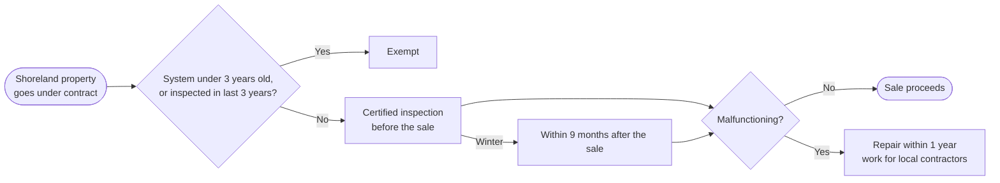

# Septic inspections at shoreland property sales

**Rank 3.** It's the closest match to the redemption center: state law creates the demand.

## The law

Since January 1, 2020, before a property in a shoreland zone is sold, its septic system has to be inspected by a state-certified inspector. If weather prevents the inspection, it must happen within 9 months after the sale. ([PL 2019 c.43](https://www.mainelegislature.org/legis/bills/bills_129th/chapters/PUBLIC43.asp); [Maine Realtors summary](https://www.mainerealtors.com/wp-content/uploads/2019/12/Septic-Systems-located-in-a-Shoreland-Zone.pdf))

- **Exempt:** systems installed within 3 years before the sale, systems with a written inspection from the last 3 years, or when the buyer certifies they'll replace the system within a year
- **If it fails:** the system must be fixed within 1 year
- **Where it applies:** every shoreland zone, meaning lakes, rivers and streams as well as the coast ([LD 216 bill text](https://legislature.maine.gov/legis/bills/bills_129th/billtexts/HP017901.asp))

## How it makes money

A fee per inspection. **Est.:** $250–700 for a pre-sale inspection ([Clever cost guide](https://listwithclever.com/real-estate-blog/septic-tank-inspection-cost/)). The farm's likely counties have many lakes and much coastline, so shoreland sales happen every year.

## License: Maine DHHS, not DEP

- Certification from a nationally recognized organization that the Department approves
- **Since July 1, 2023:** a 25-question open-book exam on Maine's subsurface wastewater rules, passed with at least 20 correct ([10-144 CMR 241 §16](https://regulations.justia.com/states/maine/10/144/chapter-241/section-144-241-16); [DHHS licensing](https://www11.maine.gov/dhhs/mecdc/services/business-services/hydrology-and-wastewater/subsurface-wastewater-licensing-certification))

## Startup cost (est.): $3k–10k

Training and certification, a probe kit, a sewer camera, and errors-and-omissions insurance. Opening a tank requires a pumper, so partner with a local septic company.

## Risks

- Professional liability if an inspection misses a problem
- Winter access to tanks
- It uses the partner's time, not the farm
- Competition: many inspectors also pump tanks

## Who does what

| Maine partner | Remote partner |
| --- | --- |
| Gets certified, does the inspections, writes the reports | Real estate agent referrals, scheduling, invoicing, report formatting |

## Next steps

- [ ] Review DHHS's list of approved certification bodies and the cost of the course
- [ ] Ask two local real estate agents how hard it is to book an inspector in season
- [ ] Find a pumper willing to partner
