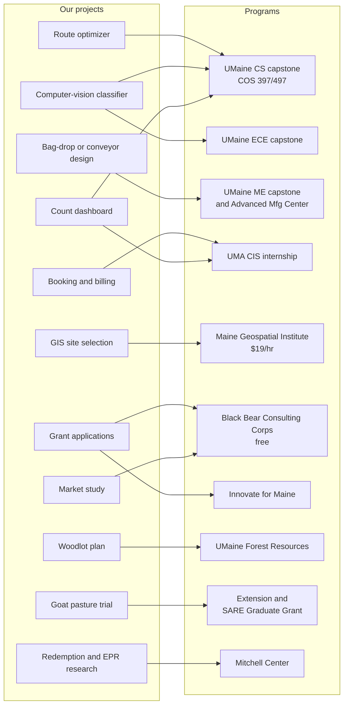
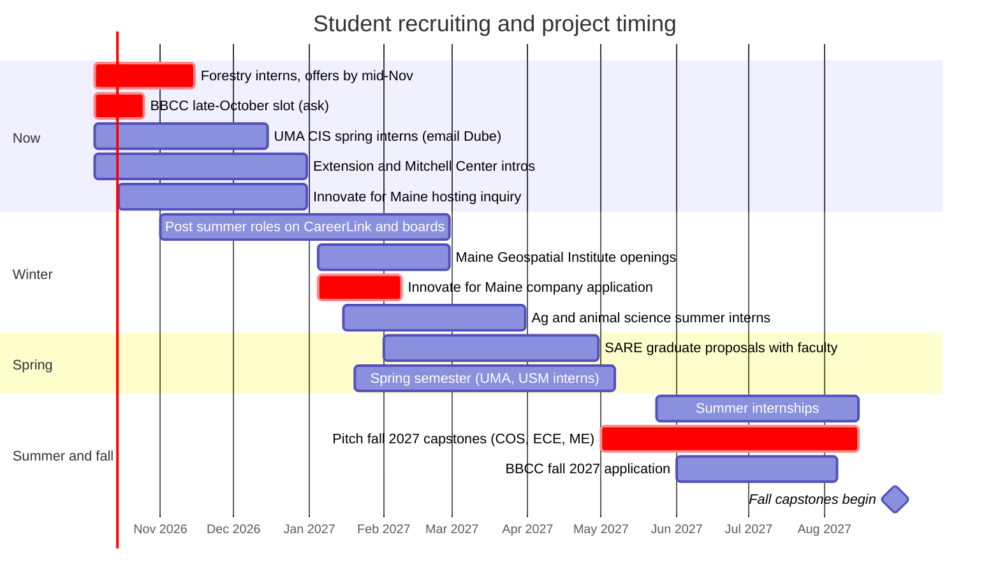
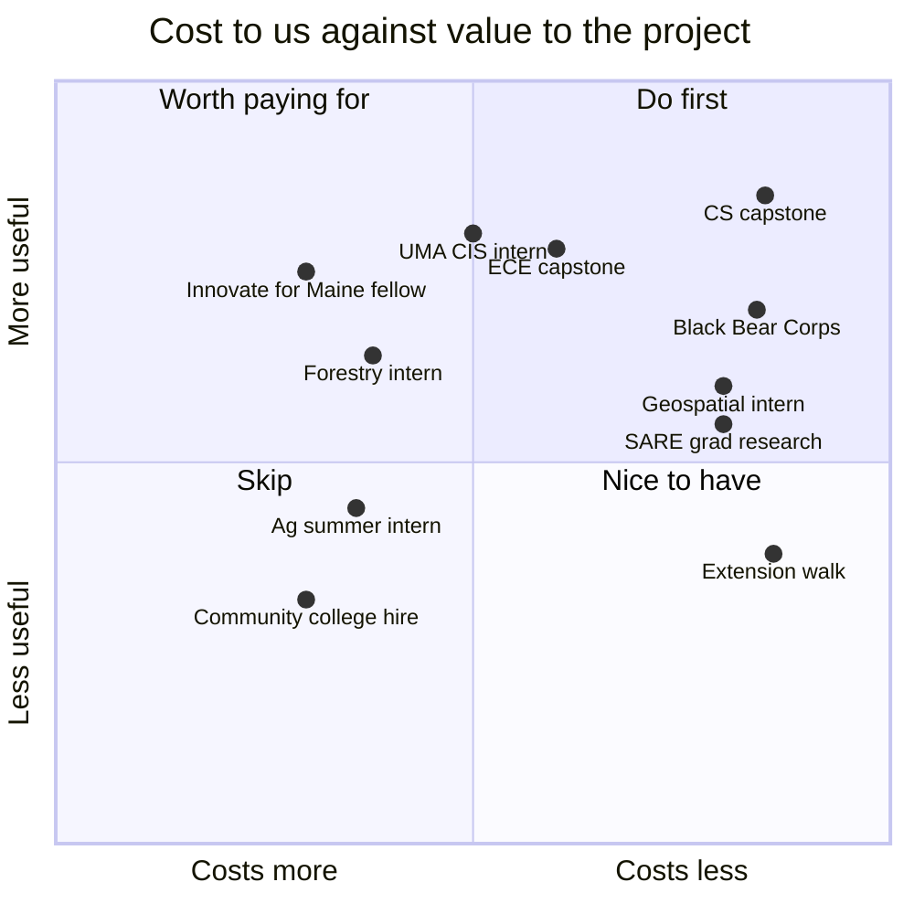

# Internships and university projects

How to bring students and faculty from Maine's public universities and community colleges into the project, in forestry, agriculture, sustainability, AI, computing, engineering, and business. Researched October 2026.

| Page | Covers |
| --- | --- |
| [forestry-ag-environment.md](https://github.com/wbp318/bottle_recycling_2027/blob/main/internships/forestry-ag-environment.md) | Forest Resources, Extension, animal science, Mitchell Center, SARE graduate grants, GIS internships |
| [tech-and-business.md](https://github.com/wbp318/bottle_recycling_2027/blob/main/internships/tech-and-business.md) | CS and engineering capstones, UMA CIS, Black Bear Consulting Corps, Innovate for Maine, USM, community colleges |
| [project-briefs.md](https://github.com/wbp318/bottle_recycling_2027/blob/main/internships/project-briefs.md) | Eleven ready-to-send project pitches |
| [hiring-rules.md](https://github.com/wbp318/bottle_recycling_2027/blob/main/internships/hiring-rules.md) | Minimum wage, unpaid internship test, payroll, I-9, workers' comp, remote supervision, IP |

## The short version

1. **Free options exist:**
   - [Black Bear Consulting Corps](https://umaine.edu/innovation/black-bear-consulting-corps/): student teams for 5 weeks, free under 50 employees
   - UMaine computer science capstones (likely free)
   - Class projects
   - Extension pasture walks
   - Hosting a graduate student's SARE-funded research
2. **Paid interns are the norm for real work.** Maine minimum wage is $15.10/hr. Counting, firewood, storage, and production code need pay.
3. **A few programs cover wages:**
   - Maine Geospatial Institute pays $19/hr from state and UMS funds.
   - USM's Career Exploration pays $19.50/hr; ask who covers it.
   - Innovate for Maine is a state-funded fellowship.

   There's no standing state intern subsidy.
4. **UMA in Augusta is likely the closest campus**, and its CIS degree **requires** an internship. Its online-first program suits a remote supervisor.
5. **Act now on forestry:** UMaine forestry interviews for summer 2027 run until mid-November 2026.
6. **The redemption center is research material.** The Mitchell Center studies packaging EPR, and a working rural center is a rare data source.

## Which program for which project

## Recruiting calendar

## Costs at a glance

How each route compares in cost to us against what we get. This is a qualitative placement.

## Start here

These are tracked as issues [#23](https://github.com/wbp318/bottle_recycling_2027/issues/23) to [#27](https://github.com/wbp318/bottle_recycling_2027/issues/27).

1. Email Eric McPherson (UMaine Forest Resources) about a summer 2027 woodlot intern or class project. Interviews end mid-November.
2. Ask the Foster Center about the late-October Black Bear Consulting Corps slot for the market study, and about hosting an Innovate for Maine fellow in 2027.
3. Email Matthew Dube (UMA CIS) about a spring 2027 intern for the count dashboard.
4. Introduce the farm to the county Extension office and the Mitchell Center.
5. Set up a free employer account on UMaine CareerLink.
6. Keep a GitHub issue per student project so remote supervision is documented.
