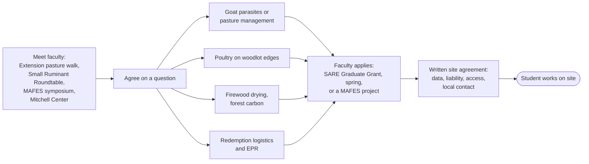

# Forestry, agriculture, and environment

Working with students and faculty in forestry, animal science, sustainable agriculture, environmental science, and recycling research. Researched October 2026.

**Labels:** **(page)** means confirmed on the linked page; **(unverified)** means from background knowledge, so confirm with the contact; **(est.)** means our estimate.

## Four things to know first

1. **The forestry window for summer 2027 is open now.** UMaine's School of Forest Resources held career fairs in September 2026. Interviews run from early October to mid-November, and offers go out in mid-November (page). Email the internship coordinator this month.
2. **UMaine posts jobs on CareerLink (Symplicity), not Handshake.** Posting is free (page).
3. **There's no standing Maine wage subsidy for interns.** The closest are time-limited, system-run programs: Maine Geospatial Institute internships pay $19/hr and accept for-profit hosts, and Innovate for Maine is a paid fellowship for Maine small businesses (page).
4. **No bottle-bill study turned up at the Mitchell Center.** Its recycling work is now on **packaging EPR**. An August 2026 article by its researchers calls Maine's 5-cent deposit "a form of EPR" (page). A working redemption center is an attractive data and field site for that research. Ask directly.

## Ranked

| # | Program | Student role | Pay | Timing | For-profit host OK? | Fit |
| --- | --- | --- | --- | --- | --- | --- |
| 1 | [UMaine School of Forest Resources internships](https://forest.umaine.edu/sfr-internships/) | Summer forestry intern: inventory, cruising, firewood planning, trail and campsite layout | We pay, about $17–22/hr (est.) | **Recruiting now**; offers by mid-November | Yes; consulting and industry hosts are common (page) | High |
| 2 | UMaine Extension county offices and [livestock program](https://extension.umaine.edu/livestock/) | Farm becomes a pasture-walk or demonstration site; door to faculty and students | Free | Any time | Yes | High |
| 3 | Forest Resources class or capstone project | Students write a woodlot management plan | Usually free (est.) | Pitch a semester ahead | Likely (est.) | High |
| 4 | [Northeast SARE Graduate Student Grant](https://northeast.sare.org/grants/get-a-grant/graduate-student-grant/) | A graduate student researches on our farm | Up to $30,000 to the student; no cost to us | Proposals usually due spring | Yes, as the research site | High |
| 5 | [Mitchell Center Materials Management](https://umaine.edu/mitchellcenter/materials-management/) | Redemption and EPR data partner, thesis site, class project | Free; possibly grant-funded | Any time | Yes, as a research partner (est.) | High (topic) |
| 6 | [Maine Geospatial Institute internships](https://www.maine.edu/maine-geospatial-institute/summer-internships/) | GIS mapping of the woodlot, campsites, storage | $19/hr × 30 hrs/week, funded by the state and UMS (page) | Openings posted January 2027 | Yes; a for-profit has hosted (page) | Medium-High |
| 7 | [UMaine Animal and Veterinary Sciences, Sustainable Agriculture](https://umaine.edu/foodandagriculture/undergraduate-programs/) | Summer goat and poultry intern | We pay | Post January to March 2027 (est.) | Yes (est.) | Medium-High |
| 8 | [Innovate for Maine Fellows](https://umaine.edu/innovateformaine/) | Business and operations intern | Paid fellowship, state-funded; our share not published | Company application around Feb 8 (page) | Yes; aimed at small businesses (page) | Medium-High |
| 9 | [UMA](https://www.uma.edu/), Augusta (Kennebec County) | Part-time help during the school year | We pay | Rolling | Yes (est.) | Medium-High (close by) |
| 10 | [Unity Environmental University](https://unity.edu/programs/) (**private**) | Agricultural Animal Science and other students; many study online from Maine | We pay | Rolling (est.) | Yes (est.) | Medium-High |
| 11 | [Mitchell Center Future Sustainability Leaders](https://umaine.edu/mitchellcenter/future-sustainability-leaders-internship-program/) | Summer sustainability intern | Unclear | Ask in winter | Past hosts were public, nonprofit, and tribal | Medium |
| 12 | [Maine Agricultural and Forest Experiment Station](https://umaine.edu/mafes/) | Faculty or graduate on-farm trial | Grant-funded | Any time | Yes, as a site | Medium |
| 13 | [Kennebec Valley CC](https://www.kvcc.me.edu/academics/programs-of-study/), Fairfield | Part-time or seasonal workers | We pay | Rolling | Yes | Medium |
| 14 | [UM Farmington](https://farmington.edu/academics/majors-programs/) | Environmental science, planning, or outdoor recreation business intern | We pay | Post February–March (est.) | Yes (est.) | Medium |
| 15 | USM and [SMCC](https://www.smccme.edu/business-community/offer-internships-jobs/) Midcoast (Brunswick) | Environmental intern or seasonal worker | We pay | Rolling | Yes | Medium |
| 16 | [Maine Woodland Owners](https://www.mainewoodlandowners.org/) (not a school) | Field days, steward program, chainsaw training | Membership | Rolling | Yes | Medium (woodlot) |
| 17 | [Federal Work-Study](https://fsapartners.ed.gov/knowledge-center/fsa-handbook/2024-2025/vol6/ch2-federal-work-study-program), off campus | Academically relevant paid job | Federal share at most 50%; we pay the rest | School decides | Yes, but **not** as a community-service job | Low-Medium |
| 18 | WIOA On-the-Job Training (local workforce boards) | Training an eligible hire | Often about 50% of wages (unverified) | Rolling | Yes | Low-Medium |
| 19 | [UM Fort Kent forestry](https://www.umfk.edu/academics/programs/forestry/) | Summer forestry intern | We pay, plus housing | Fall and winter (est.) | Yes | Low-Medium (far) |
| 20 | [UM Presque Isle agriculture](https://www.umpi.edu/academics/academic_programs/agricultural-science/) | Summer farm intern | We pay, plus housing | Winter (est.) | Yes | Low-Medium (far) |
| 21 | [UM Machias](https://machias.edu/academics/majors-programs/) | Campground or recreation intern | We pay | Winter (est.) | Yes | Low |

## Details

**School of Forest Resources** ([programs](https://forest.umaine.edu/undergraduate-programs/)).

- **Majors:** forestry (SAF-accredited); parks, recreation and tourism, which fits the campsites; sustainable materials, which fits firewood; ecology; and a 4+1 Master of Forestry.
- **Who hosts now:** mostly large landowners, agencies, and land trusts. A small farm would be an unusual host, so pitch a clearly scoped project.
- **Supervision:** a field intern needs a local supervisor. A licensed consulting forester as co-mentor would make it credible (est.).
- **Contact:** Eric McPherson, eric.mcpherson@maine.edu, 207-581-2887.

**UMaine Extension.** Hosting a pasture walk or a Small Ruminant Roundtable event is the usual, free way to meet faculty and students.

| Office | Contact |
| --- | --- |
| [Kennebec](https://extension.umaine.edu/kennebec/) | 207-622-7546, extension.kennebec@maine.edu |
| [Waldo](https://extension.umaine.edu/waldo/) | 207-342-5971, extension.waldo@maine.edu |
| [Knox-Lincoln](https://extension.umaine.edu/knox-lincoln/) | Runs the Midcoast Sustainable Agriculture Program |
| Statewide livestock | 207-581-3188: Small Ruminant Roundtable (goats), pasture walks, Pasture Management Course |

**Mitchell Center.** Its materials-management team (anthropology, economics, engineering) works on Maine solid waste, and the current focus is packaging EPR, which takes effect in Maine in 2027 ([article](https://umaine.edu/mitchellcenter/2026/08/27/erin-victor-article-on-packaging-waste-published-in-the-conversation/)). UMaine's Digital Commons repository was retired June 30, 2026, so older studies may have moved. Pitch the center as a field site for questions like:

- How containers flow through a rural center
- How the handling fee covers costs
- Rural access to redemption

Contact Travis Blackmer or umgmc@maine.edu, 207-581-3195.

**SARE Graduate Student Grant.** Up to $30,000 over up to two years. A faculty advisor is the official investigator, and the project must help Northeast farmers. Our cost is access and time.

**Maine Geospatial Institute.** $19/hr for 30 hours a week for 10+ weeks, funded by the state and the University of Maine System. It's open to students from any UMS campus. Contact Eileen Moran, eileen.moran@maine.edu.

## Hosting a graduate student's research on the farm

## Drive times to campuses (est.)

| Campus | From Augusta | From Rockland | From Belfast | From Damariscotta |
| --- | --- | --- | --- | --- |
| UMaine Orono | 1h15 | 1h30 | 1h | 1h40 |
| UMA Augusta | 0 | 1h | 50m | 40m |
| KVCC Fairfield | 30m | 1h20 | 1h | 1h |
| CMCC Auburn | 45m | 1h30 | 1h40 | 1h |
| SMCC Midcoast, Brunswick | 40m | 1h | 1h20 | 30m |
| USM Portland | 1h | 1h40 | 2h | 1h10 |
| Unity at Pineland, New Gloucester | 50m | 1h30 | 1h45 | 1h |
| UM Farmington | 50m | 1h50 | 1h40 | 1h30 |
| UM Machias | about 3h | 2h45 | 2h15 | 3h |
| UM Presque Isle | about 3h45 | about 4h15 | about 3h45 | about 4h15 |
| UM Fort Kent | about 4h45 | about 5h | about 4h30 | about 5h |

## Not a fit

- **Community colleges:** KVCC's program list no longer shows agriculture (its old sustainable-agriculture page is gone), though its job board carries outside farm internships. CMCC, NMCC, and WCCC have no forestry or agriculture programs.
- **USDA NIFA and Forest Service student programs** fund universities or federal jobs, so there's no route for a private host.
- **Maine Maritime Academy** isn't relevant beyond possible boat-storage labor.
