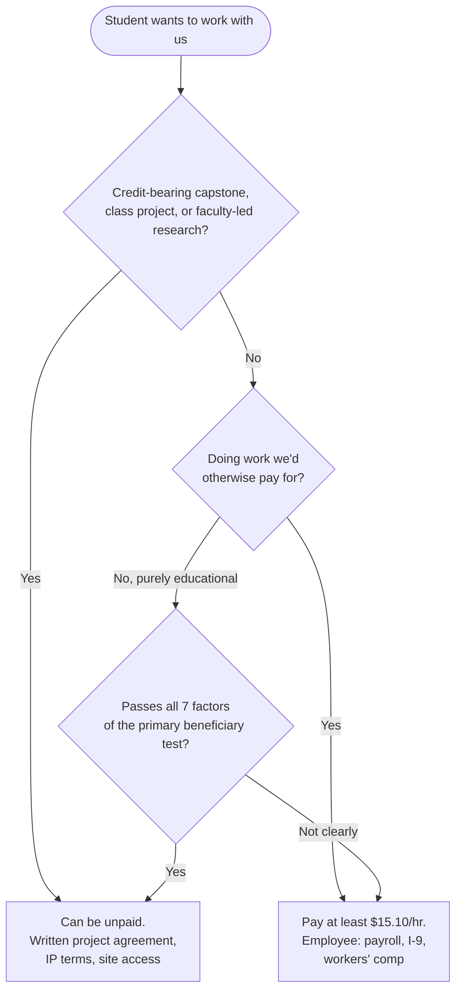

# Hiring rules for interns

The practical rules for an LLC taking on students. Researched October 2026. Confirm payroll details with an accountant and coverage with the insurer.

## Pay them

- **Maine minimum wage is $15.10/hr from January 1, 2026** (it was $14.65 in 2025). The 2027 rate is adjusted for inflation. Rockland has its own, possibly higher, local minimum wage ([Maine DOL](https://www.maine.gov/labor/labor_laws/minimumwagefaq/)).
- **Unpaid internships at a for-profit must pass the federal primary beneficiary test** ([DOL Fact Sheet 71](https://www.dol.gov/agencies/whd/fact-sheets/71-flsa-internships)). Its seven factors:
  1. No expectation of pay
  2. Training similar to school
  3. Tied to coursework or credit
  4. Fits the academic calendar
  5. Limited to the learning period
  6. Complements rather than displaces paid workers
  7. No promise of a job
- **In practice:** counting containers, splitting firewood, running storage, or building production software is work, so **pay for it.** Unpaid fits only credit-bearing capstones, class projects, and research directed by faculty.

## Payroll basics for the LLC (confirm with an accountant)

- **Accounts and registrations:**
  - EIN
  - Maine Revenue Services withholding account
  - Maine DOL ReEmployME unemployment account
- **Forms and reporting:**
  - Federal W-4 and Maine W-4ME
  - Report new hires to Maine within 7 days
- **Taxes and contributions:**
  - FICA and FUTA. The student FICA exemption applies only when the school is the employer.
  - Maine Paid Family and Medical Leave contributions began in 2025 at 1% of wages. Employers with fewer than 15 employees pay only the 0.5% employee share, which can be withheld.
- **Other:**
  - Labor law posters
  - Maine's earned paid leave applies only to employers with more than 10 employees
- **Payroll service:** Gusto, ADP, or similar handles most of this for about $40–80 a month (est.).

## Form I-9

- **Deadlines:** Section 1 by the first day of work; Section 2 within 3 business days ([USCIS](https://www.uscis.gov/i-9-central/complete-and-correct-form-i-9)).
- **Remote document checks:** examining documents by video is allowed only for employers enrolled in **E-Verify**. Otherwise, use an authorized representative near the student, such as a notary.
- **Retention:** keep the form 3 years after hire or 1 year after the job ends, whichever is later.

## Workers' compensation

Paid interns are employees, so the LLC needs coverage for redemption, firewood, and storage work.

Maine exempts some **agricultural** laborers if the farm carries set amounts of employer's liability and medical coverage ([39-A M.R.S. §401](https://legislature.maine.gov/statutes/39-A/title39-Asec401.html)). That exemption doesn't cover non-farm work, so it won't cover the redemption center, firewood sales, or storage. Unpaid credit interns may be covered only by the school's policy, if at all.

Confirm with the insurer and the Workers' Compensation Board coverage unit, 207-287-7071.

## Remote supervision

- **Office work:** business, data, GIS, and software projects can be supervised remotely, with weekly video check-ins and GitHub issues documenting the work.
- **Field work:** livestock, chainsaws, equipment, and the counting floor need an **on-site supervisor**, either the Maine partner or a local forester or mentor.
- **Where the intern works decides the law:** wage, tax, and unemployment rules follow the state the student physically works in. A student working from another state may mean registering there.

## Housing and travel

- **Housing:** UMS keeps a summer housing list for interns ([UMaine](https://umaine.edu/career/internship-housing-summer/)).
- **Travel:** for a rural site, budget mileage of about $0.70 a mile (est.).
- **On-farm lodging:** if offered (a campsite or bunkhouse), put its value and terms in writing and check how it counts toward wages.

## Intellectual property

- **Paid interns:** an IP assignment in the offer letter.
- **Capstones and class projects:** students own their code by default, and many departments won't allow exclusive assignments or NDAs for graded work. Agree before the start on an open-source license or a permitted assignment.
- **Research partners:** a written site agreement covering data ownership, publication, liability, and access.
